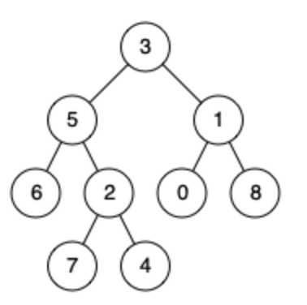

# 题目

https://leetcode.cn/problems/lowest-common-ancestor-of-a-binary-tree/description/


二叉树的最近公共祖先

## 题意

给定一个二叉树, 找到该树中两个指定节点的最近公共祖先。

百度百科中最近公共祖先的定义为：“对于有根树 T 的两个节点 p、q，最近公共祖先表示为一个节点 x，满足 x 是 p、q 的祖先且 x 的深度尽可能大（一个节点也可以是它自己的祖先）。”



## 思路

这道题自认为代码还挺trick的。
没有了二叉搜索树的性质，最容易想到的就是自底向上，使用后续遍历进行搜索。

这个问题有两种情况：
1. 两个节点互相不为对方的祖先节点。比如，节点2和节点6。
2. 两个节点中的一个节点是另外一个节点的祖先节点。比如，节点7和节点2。

后续遍历的递归函数的定义：  
```golang
postOrder = func(node *TreeNode, p *TreeNode, q *TreeNode) *TreeNode {
} 
```
要在以node为根节点的树种，找出节点p和节点q的最近公共祖先。

考虑情况1：两个节点互相不为对方的祖先节点。这里以节点5和节点1举例。后续遍历递归的时候，如果发现左右子树的返回值都不为空，则表明节点p和节点q分别位于当前节点的左右子树中。
那么当前节点就是最近公共祖先。

考虑情况2：
两个节点中的一个节点是另外一个节点的祖先节点。这里以节点2和节点4为例。在进行递归的时候，碰到节点2应该直接将节点2返回。节点2就是最近的公共祖先。也就是高度较高的节点时最近公共祖先。此时不需要继续向下递归。体会一下。


## 代码


```golang

func lowestCommonAncestor(root, p, q *TreeNode) *TreeNode {

	var postOrder func(node *TreeNode, p *TreeNode, q *TreeNode) *TreeNode
	postOrder = func(node *TreeNode, p *TreeNode, q *TreeNode) *TreeNode {
		if node == nil || node == p || node == q {
			return node
		}

		left := postOrder(node.Left, p, q)
		right := postOrder(node.Right, p, q)

		// 三种情况
		if left != nil && right != nil { // 1.左右都不为空，自底向上看的话，当前节点就是最小公共祖先 对应情况1
			return node
		} else if left != nil { // left 不为空 right为空 对应情况2
			return left
		} else if right != nil { // left 不为空 right 为空 对应情况2
			return right
		}
		return nil
	}
	return postOrder(root, p, q)
}

```