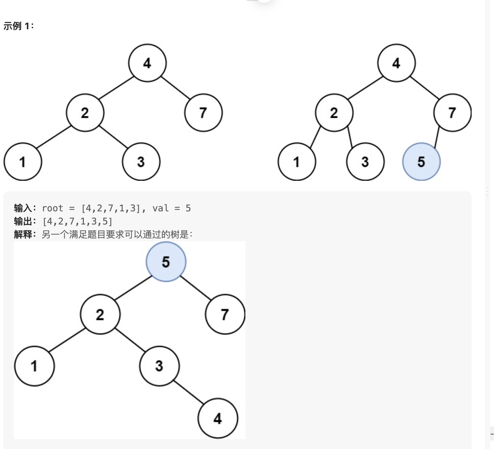

# 题目
https://leetcode.cn/problems/insert-into-a-binary-search-tree/

二叉搜索树中的插入操作

## 题意
给定二叉搜索树（BST）的根节点 root 和要插入树中的值 value ，将值插入二叉搜索树。 返回插入后二叉搜索树的根节点。 输入数据 保证 ，新值和原始二叉搜索树中的任意节点值都不同。
注意，可能存在多种有效的插入方式，只要树在插入后仍保持为二叉搜索树即可。 你可以返回 任意有效的结果 。



## 思路

使用二叉搜索树的性质。将待插入的节点值和当前指针指向的节点进行比较。
如果待插入的节点值大于当前节点值，则指针需要向右走。  
如果待插入的节点值小于当前节点值，则指针需要向左走。  
如果指针走到了一个空值处，则代表待插入节点就应该在这个空值处。


二叉搜索树的节点插入本身也是一个搜索的过程。        
可以认为，当前的任务就是在BST中搜索值为Val的节点。  
如果找不到，则把这个值插入到对应的位置。


查找的过程既可以使用递归来实现，也可以使用迭代实现。
相比较于迭代实现，递归实现更加简单。
主要是递归插入简化了父子节点之间的链接过程。下一层再向上一层返回时，父节点可以轻松指向子节点。

## 代码


递归代码


```golang

func insertIntoBST(root *TreeNode, val int) *TreeNode {

	var insert func(node *TreeNode, val int) *TreeNode
	insert = func(node *TreeNode, val int) *TreeNode {
		if node == nil {
			return &TreeNode{
				Val:   val,
				Left:  nil,
				Right: nil,
			}
		}
		if node.Val > val {
			node.Left = insert(node.Left, val)

		} else if node.Val < val {
			node.Right = insert(node.Right, val)
		}
		return node
	}
	root = insert(root, val)
	return root
}

```


迭代代码  
迭代代码需要注意的地方就是代码注释的分类讨论这个地方。  
当cur指针走向下一个节点，下一个节点可能为空，也可能不为空。  
如果不为空，则继续进入下一轮判断 -> cur = cur.left or cur = cur.right  
如果为空，则可以将待插入节点作为cur的孩子节点。插入完毕后直接退出循环。  

```golang

func insertIntoBSTIter(root *TreeNode, val int) *TreeNode {
	if root == nil {
		return &TreeNode{Val: val}
	}

	cur := root
	for {
		if val < cur.Val {
            // 分类讨论
			if cur.Left != nil {
				cur = cur.Left
			} else {
				cur.Left = &TreeNode{Val: val}
				break
			}
		} else { // val > cur.val
			if cur.Right != nil {
				cur = cur.Right
			} else {
				cur.Right = &TreeNode{Val: val}
				break
			}
		}
	}
	return root
}


```

