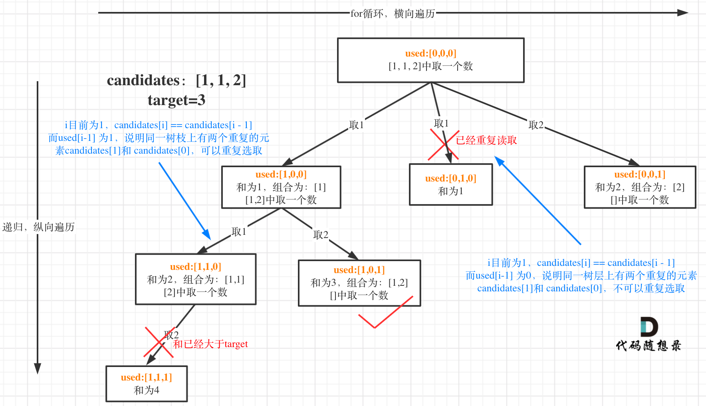
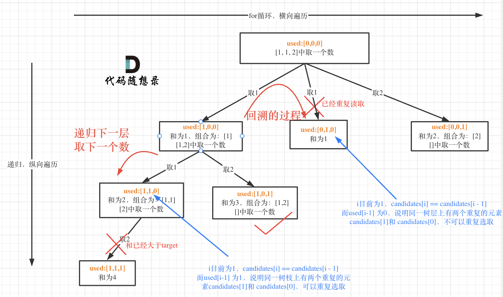

# 题目
https://leetcode.cn/problems/combination-sum-ii/description/


## 题意
给定一个候选人编号的集合 candidates 和一个目标数 target ，找出 candidates 中所有可以使数字和为 target 的组合。
candidates 中的每个数字在每个组合中只能使用 一次 。
注意：解集不能包含重复的组合。 

输入: candidates = [2,5,2,1,2], target = 5,
输出:
[
[1,2,2],
[5]
]

## 思路





> https://programmercarl.com/0040.%E7%BB%84%E5%90%88%E6%80%BB%E5%92%8CII.html#%E5%9B%9E%E6%BA%AF%E4%B8%89%E9%83%A8%E6%9B%B2
> 这个去重为什么很难理解呢，所谓去重，其实就是使用过的元素不能重复选取。 这么一说好像很简单！都知道组合问题可以抽象为树形结构，那么“使用过”在这个树形结构上是有两个维度的，一个维度是同一树枝上使用过，一个维度是同一树层上使用过。没有理解这两个层面上的“使用过” 是造成大家没有彻底理解去重的根本原因。




使用used数组，向前可以查看某个数字之前有没有被使用过。
对于candidates[i]来说，
如果candidates[i-1]==true 表示前一个数字当前正在path中。
如果candidates[i-1]==false 表示前一个数字之前肯定被使用过。
(前一个数字要么当前被使用，要么当前没有被使用。如果当前没有被使用，又因为出现在i的前面，所以之前肯定被使用过)。


## 代码

```go

func combinationSum2(candidates []int, target int) [][]int {

	sort.Ints(candidates)
	var used = make([]bool, len(candidates))
	var ans [][]int
	var path []int

	var traceback func(startIndex int, sum int)
	traceback = func(startIndex int, sum int) {
		if sum == target {
			temp := make([]int, len(path))
			copy(temp, path)
			ans = append(ans, temp)
			return
		}
		for i := startIndex; i < len(candidates) && candidates[i]+sum <= target; i++ {
			if i != 0 && candidates[i] == candidates[i-1] && used[i-1] == false {
				continue
			}
			path = append(path, candidates[i])
			used[i] = true
			traceback(i+1, sum+candidates[i])
			used[i] = false
			path = path[:len(path)-1]
		}
	}

	traceback(0, 0)
	return ans

}


```