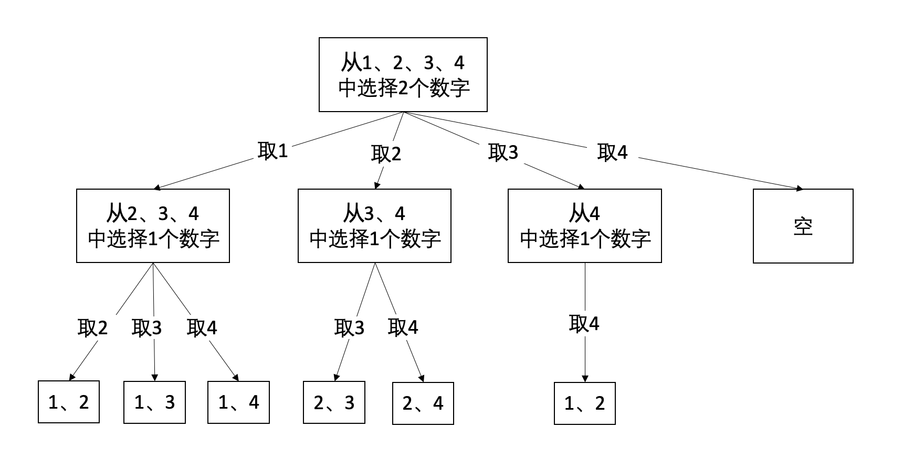

# 题目
https://leetcode.cn/problems/combinations/description/


## 题意
给定两个整数 n 和 k，返回范围 [1, n] 中所有可能的 k 个数的组合。
你可以按 任何顺序 返回答案。

输入：n = 4, k = 2
输出：
[
  [2,4],
  [3,4],
  [2,3],
  [1,2],
  [1,3],
  [1,4],
]

## 思路




可以使用递归的思路进行解答。
首先取1，那么问题便成为了，从[2、3、4]中取一个数字，会有哪些组合。
取2，那么问题便成为了，从[3、4]中取一个数字，会有哪些组合。
依次类推，可以发现每次取一个数字后，剩下面对的问题只是规模变得更小。


剪枝  
如果从1，2，3，4中取4个数字。可以发现当我们在第一层取2的时候，此时还需要取3个数字，然而剩余待取空间中的数字只有[3，4]，无法提供足够的数字可取。
也就是说，剩余的数字空间需要满足一定的条件。

剩余的数字个数+当前已经放入结果集合中的数字个数 >= 需要取到的数字的个数
剩余的数字个数=(n-startNumber+1)  
当前结果集合中的数字个数=depth
需要取到的数字个数=k  
于是有（n-startNumber+1） + depth >= k 


## 代码

这段代码中，depth变量用来记录当前路径上收集的元素的个数（也就是path中元素的个数）。
因此，当depth等于k的时候，应该达到一个叶子节点，相应地应该收集结果。
在编写代码的时候，要明确每一个变量的定义。

```go

func combine(n int, k int) [][]int {

	var ans [][]int
	var path []int

	var traceBack func(startNumber int, depth int)
	traceBack = func(startNumber int , depth int) {
		if depth == k {
			temp := make([]int, depth)
			copy(temp, path)
			ans = append(ans, temp)
			return
		}

		for i := startNumber; i <= n; i++ {
            
            if n-startNumber+1+depth < k { // 剪枝
				return
			}
			path = append(path, i)
			traceBack(i+1, depth+1)
			path = path[:len(path)-1]
		}
	}

	traceBack(1, 0)
	return ans
}

```

本题不需要明确构建一个[1...n]这样的数组，然后每次从数组中取数。只需要用一个startNumber标记每次数组开始的地方即可。

