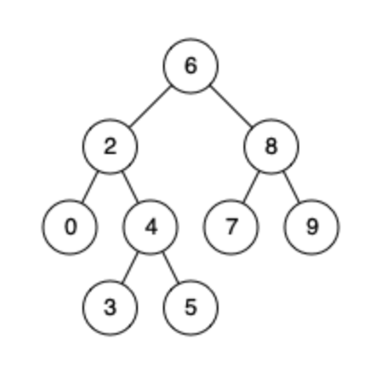

# 题目

https://leetcode.cn/problems/lowest-common-ancestor-of-a-binary-search-tree/description/

二叉搜索树最近公共祖先


## 题意

给定一个二叉搜索树, 找到该树中两个指定节点的最近公共祖先。
百度百科中最近公共祖先的定义为：“对于有根树 T 的两个结点 p、q，最近公共祖先表示为一个结点 x，满足 x 是 p、q 的祖先且 x 的深度尽可能大（一个节点也可以是它自己的祖先）。”
例如，给定如下二叉搜索树:  root = [6,2,8,0,4,7,9,null,null,3,5]



## 思路

在二叉搜索树的问题中，一定要利用上树的顺序性。
首先任意举几个例子，比如节点5和节点7的最近公共祖先，应该是节点6，节点6的值在闭区间[5 ，7]中。
节点3和节点5的最近公共祖先，应该是节点4，节点4的值在闭区间[3 ，5]中。

可以发现（未经过证明），节点p和节点q的最近公共祖先的值在闭区间[p , q] 中。

具体的搜索过程，可以这样：假设当前需要搜索节点3和节点5的最近公共祖先。  
1. 使用遍历的方法，从节点6开始进行遍历。  
2. 6的值在闭区间[3 ，5]的右边，也就是节点3和节点5在节点6的左边。那么最近的公共祖先肯定在节点6的左子树上。于是搜索的方向需要向左，来到节点2。  
3. 2的值在闭区间[3 , 5]的左边，也就说节点3和节点5在节点2的右边。那么最近的公共祖先肯定在节点2的右子树上。于是搜索的方向需要向右，来到节点4。
4. 4的值在闭区间[3 , 5]之间，也就说两个节点分别位于节点4的左右子树上。这个时候，搜索可以返回。节点4就是节点3和节点5的最近公共祖先。


Q : 任意两个节点之间，落到区间中的节点只有一个吗？  
A : 不是的。例如，对于节点0和节点9构成的区间[0 , 9]来说，节点2、节点8、节点6都符合这个要求。

Q : 为什么自顶向下第一个落到区间中的节点就是最近公共节点？（8也在0到9之间，为什么8不能是最近公共祖先？）  
A : 以节点0和节点9的最近公共祖先为例，节点0和节点9一定是祖先节点的孩子节点。节点0和节点9的最近公共节点为6。当指针指向节点6的时候，如果向左走，那么将错过节点9的祖先。如果向右走，那么将错过节点0的祖先。
这里如何理解呢？第一个符合区间要求[0 , 9]的是节点6。此时，必然有节点0和节点9分别在节点6的左右两侧，或者是在同一侧。如果从节点6再向左或者向右走一步。同侧，或者两侧的条件将会被破坏。比如，走到节点8，此时会发现，节点0已经不在节点8的子树中。这一点需要体会。


## 代码


```golang
func lowestCommonAncestorBST(root, p, q *TreeNode) *TreeNode {

	var preOrder func(node, p, q *TreeNode) *TreeNode
	preOrder = func(node, p, q *TreeNode) *TreeNode {
		if node == nil {
			return nil
		}

		if node.Val > p.Val && node.Val > q.Val {
			return preOrder(node.Left, p, q)
		} else if node.Val < p.Val && node.Val < q.Val {
			return preOrder(node.Right, p, q)
		} else {
			return node // 落在区间，直接返回
		}
	}

	return preOrder(root, p, q)
}
```


