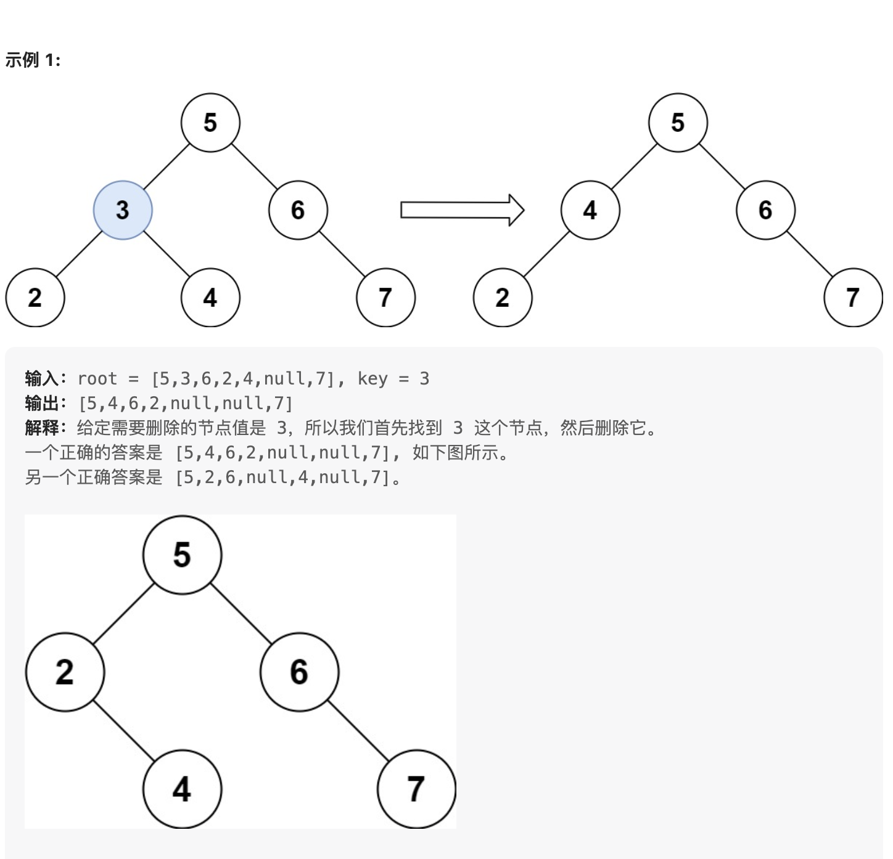

# 题目
https://leetcode.cn/problems/delete-node-in-a-bst/

删除二叉搜索树中的节点

## 题意

给定一个二叉搜索树的根节点 root 和一个值 key，删除二叉搜索树中的 key 对应的节点，并保证二叉搜索树的性质不变。返回二叉搜索树（有可能被更新）的根节点的引用。

一般来说，删除节点可分为两个步骤：

首先找到需要删除的节点；
如果找到了，删除它。




## 思路

按照题目的提示，代码也可以分为两个步骤。
1. 找到节点
2. 删除节点

找到节点这一步比较简单。  
如果当前节点的值大于给定的值，则指针移动到当前节点的左孩子。  
如果当前节点的值小于给定的值，则指针移动到当前节点的右孩子。  
如果当前节点的值等于给定的值，则表示找到了待删除的节点。


删除节点分3种情况：
1. 当前节点没有左右孩子，是一个叶子节点。这种情况直接将当前节点置为null即可。  
2. 当前节点只有左孩子。这个时候直接将当前节点的左孩子返回到上一层即可。这里可以参考👇🏻的示例，删除节点4，只需要将节点4的孩子网上抛。

```txt
         5
        / \
      4    6
     /
    3
   /
  2
```
3. 当前节点只有右孩子。这个时候，直接将当前节点的右孩子直接返回到上一层即可。这里可以参考👇🏻的示例，删除节点1，只需要将节点1的孩子节点2向上抛。

```txt
         5
        / \
       1   6
       \
        2  
         \
          3
```

4. 当前节点左右孩子都不为空。比如，删除节点1。按照二叉搜索树的性质，应该在节点1的右子树中找一个最小值minNode，把这个最小值minNode从节点1的右子树中删除。然后让minNode取代节点1的位置。这样做有点复杂了，因为再一次涉及删除操作。**实际可以这样做：找到右子树最小的那个元素minNode，把左子树挂到minNode，使之成为其左孩子。**

```txt
         5
        / \
      1    6
    /  \
  -1    2  
         \
          3
```


## 代码


```golang

func deleteNode(root *TreeNode, key int) *TreeNode {

	var deleteAux func(node *TreeNode, key int) *TreeNode
	deleteAux = func(node *TreeNode, key int) *TreeNode {
		if node == nil {
			return nil
		}

		if node.Val > key { //left
			node.Left = deleteAux(node.Left, key)
			return node
		} else if node.Val < key {
			node.Right = deleteAux(node.Right, key)
			return node
		} else { // 当前节点
			if node.Left == nil && node.Right == nil { // 叶子节点
				return nil
			} else if node.Left != nil && node.Right == nil { // 左孩子存在
				left := node.Left
				node.Left = nil
				return left
			} else if node.Right != nil && node.Left == nil {
				right := node.Right
				node.Right = nil
				return right
			} else { // 左右都不为空 右孩子向上提、左孩子挂上去（找到右子树最小的那个元素，把左子树挂上去）
				left := node.Left
				right := node.Right

				node.Left = nil
				position := node.Right
				for position.Left != nil {
					position = position.Left
				}
				position.Left = left
				node.Right = nil
				return right
			}
		}

	}
	return deleteAux(root, key)


```