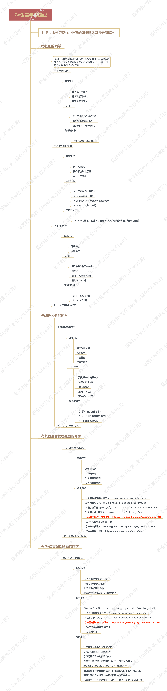
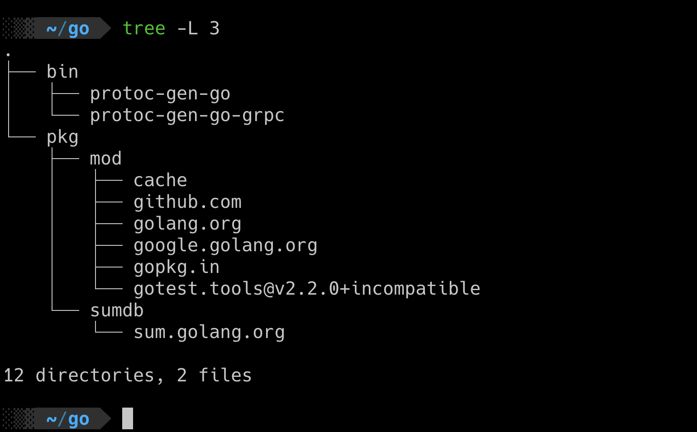

# go语言基础知识

Last edited time: April 19, 2023 3:48 PM
Owner: Anonymous

## 导读

### go语言的学习路线


## 基础知识

### 工作区和GOPATH




### 类型断言表达式

```go
package main

import "fmt"

var container = []string{"zero", "one", "two"}

func main() {
  container := map[int]string{0: "zero", 1: "one", 2: "two"}
  fmt.Printf("The element is %q.\n", container[1])
}
```

怎样在打印其中元素之前，正确判断变量container的类型？

使用类型断言表达式：

```go
value, ok := interface{}(container).([]string)
```

它包括了用来把container变量的值转换为空接口值的interface{}(container)。以及一个用于判断前者的类型是否为切片类型 []string 的 .([]string)。

- 是否可以去掉将container变量的值转换为空接口值的interface{}(container)
    
    答案是不可以。golang要求必须这样转换。
    

```go
package main

import "fmt"

var container = []string{"zero", "one", "two"}

func main() {
	container := map[int]string{0: "zero", 1: "one", 2: "two"}
	value, ok := interface{}(container).(map[int]string)
	if ok {
		fmt.Println(value)
	} else {
		fmt.Println(value)
	}
	fmt.Printf("The element is %q.\n", container[1])
}
```

类型断言表达式的语法形式是x.(T)。其中的x代表要被判断类型的值。这个值当下的类型必须是接口类型的，不过具体是哪个接口类型其实是无所谓的。

在 Go 语言中，interface{}代表空接口，任何类型都是它的实现类型。我在下个模块，会再讲接口及其实现类型的问题。现在你只要知道，任何类型的值都可以很方便地被转换成空接口的值就行了。这里的具体语法是interface{}(x)，例如前面展示的interface{}(container)。

### 别名类型

```go
// 类型再定义 -> 不使用等号
type myString string

// 类型别名 -> 使用等号

type myString2 = string
```

这行代码进行了类型再定义。它将string类型重新定义成了mystring类型。string可以被称为myString的潜在类型。潜在类型的含义是，某个类型在本质上是哪个类型。

潜在类型相同的不同类型的值之间是可以进行类型转换的。因此，MyString2类型的值与string类型的值可以使用类型转换表达式进行互转。但对于集合类的类型[]MyString2与[]string来说这样做却是不合法的，因为[]MyString2与[]string的潜在类型不同，分别是[]MyString2和[]string。另外，即使两个不同类型的潜在类型相同，它们的值之间也不能进行判等或比较，它们的变量之间也不能赋值。