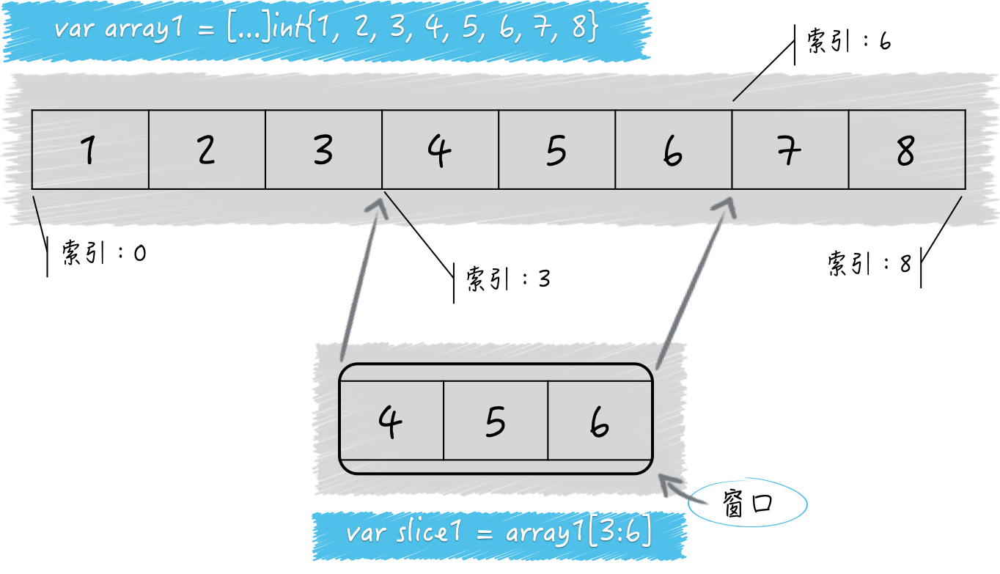

# go语言进阶知识

Last edited time: April 19, 2023 3:50 PM
Owner: Anonymous

### 数组和切片

切片与数组之间的关系：

- 切片的底层是数组。类似于Java中的arrayList与数组之间的关系。



1. 如何估算切片容量的增长

```go
package main

import "fmt"

func main() {
	// 示例1。
	s6 := make([]int, 0)
	fmt.Printf("The capacity of s6: %d\n", cap(s6))
	for i := 1; i <= 5; i++ {
		s6 = append(s6, i)
		fmt.Printf("s6(%d): len: %d, cap: %d\n", i, len(s6), cap(s6))
	}
	fmt.Println()

	// 示例2。
	s7 := make([]int, 1024)
	fmt.Printf("The capacity of s7: %d\n", cap(s7))
	s7e1 := append(s7, make([]int, 200)...)
	fmt.Printf("s7e1: len: %d, cap: %d\n", len(s7e1), cap(s7e1))
	s7e2 := append(s7, make([]int, 400)...)
	fmt.Printf("s7e2: len: %d, cap: %d\n", len(s7e2), cap(s7e2))
	s7e3 := append(s7, make([]int, 600)...)
	fmt.Printf("s7e3: len: %d, cap: %d\n", len(s7e3), cap(s7e3))
	fmt.Println()

	// 示例3。
	s8 := make([]int, 10)
	fmt.Printf("The capacity of s8: %d\n", cap(s8))
	s8a := append(s8, make([]int, 11)...)
	fmt.Printf("s8a: len: %d, cap: %d\n", len(s8a), cap(s8a))
	s8b := append(s8a, make([]int, 23)...)
	fmt.Printf("s8b: len: %d, cap: %d\n", len(s8b), cap(s8b))
	s8c := append(s8b, make([]int, 45)...)
	fmt.Printf("s8c: len: %d, cap: %d\n", len(s8c), cap(s8c))
}
```

一旦一个切片无法容纳更多的元素，Go 语言就会想办法扩容。但它并不会改变原来的切片，而是会生成一个容量更大的切片，然后将把原有的元素和新元素一并拷贝到新切片中。在一般的情况下，你可以简单地认为新切片的容量（以下简称新容量）将会是原切片容量（以下简称原容量）的 2 倍。但是，当原切片的长度（以下简称原长度）大于或等于1024时，Go 语言将会以原容量的1.25倍作为新容量的基准（以下新容量基准）。新容量基准会被调整（不断地与1.25相乘），直到结果不小于原长度与要追加的元素数量之和（以下简称新长度）。最终，新容量往往会比新长度大一些，当然，相等也是可能的。另外，如果我们一次追加的元素过多，以至于使新长度比原容量的 2 倍还要大，那么新容量就会以新长度为基准。注意，与前面那种情况一样，最终的新容量在很多时候都要比新容量基准更大一些。更多细节可参见runtime包中 slice.go 文件里的growslice及相关函数的具体实现。

1. 切片的底层数组不会被替换

修改s9会导致a1的部分数据最后被修改。

```go
import "fmt"

func main() {
	// 示例1。
	a1 := [7]int{1, 2, 3, 4, 5, 6, 7}
	fmt.Printf("a1: %v (len: %d, cap: %d)\n",
		a1, len(a1), cap(a1))
	s9 := a1[1:4]
	//s9[0] = 1
	fmt.Printf("s9: %v (len: %d, cap: %d)\n",
		s9, len(s9), cap(s9))
	for i := 1; i <= 5; i++ {
		s9 = append(s9, i)
		fmt.Printf("s9(%d): %v (len: %d, cap: %d)\n",
			i, s9, len(s9), cap(s9))
	}
	fmt.Printf("a1: %v (len: %d, cap: %d)\n",
		a1, len(a1), cap(a1))
	fmt.Println()

}

//
a1: [1 2 3 4 5 6 7] (len: 7, cap: 7)
s9: [2 3 4] (len: 3, cap: 6)
s9(1): [2 3 4 1] (len: 4, cap: 6)
s9(2): [2 3 4 1 2] (len: 5, cap: 6)
s9(3): [2 3 4 1 2 3] (len: 6, cap: 6)
s9(4): [2 3 4 1 2 3 4] (len: 7, cap: 12)
s9(5): [2 3 4 1 2 3 4 5] (len: 8, cap: 12)
a1: [1 2 3 4 1 2 3] (len: 7, cap: 7)
```

### container包中的容器

container包时go自带的包。包含heap、list、与ring三种容器。

- 后期有时间回来把源代码读一遍

[go/src/container at master · golang/go](https://github.com/golang/go/tree/master/src/container)

1. 延迟初始化
    
    list使用了延迟初始化的机制。为了解决像数组这种 声明的时候就分配了内存空间的问题，有的时候我们只需要声明，但还不需要使用它，这个时候没有必要分配内存空间，再如文中提到的 在同一时刻声明大量的内存空间的话 那么cpu的使用和内存空间的使用将会激增。所以我们需要延迟初始化机制(设计模式中的单例模式也提到了延迟初始化问题,避免声明出来没人使用的尴尬局面)
    
2. list
    
    list的底层是链表。可以基于list实现stack 、queue等数据结构。
    
3. ring
    
    对于ring来说，它可以用于保存固定数量的元素。比如，程序最近产生的100条日志数据。
    
4. list与ring之间的不同之处
- Ring类型的数据结构仅由它自身即可代表，而List类型则需要由它以及Element类型联合表示。这是表示方式上的不同，也是结构复杂度上的不同。
- 一个Ring类型的值严格来讲，只代表了其所属的循环链表中的一个元素，而一个List类型的值则代表了一个完整的链表。这是表示维度上的不同。在创建并初始化一个Ring值的时候，我们可以指定它包含的元素的数量，但是对于一个List值来说却不能这样做（也没有必要这样做）。循环链表一旦被创建，其长度是不可变的。这是两个代码包中的New函数在功能上的不同，也是两个类型在初始化值方面的第一个不同。
- 仅通过var r ring.Ring语句声明的r将会是一个长度为1的循环链表，而List类型的零值则是一个长度为0的链表。别忘了List中的根元素不会持有实际元素值，因此计算长度时不会包含它。这是两个类型在初始化值方面的第二个不同。
- Ring值的Len方法的算法复杂度是 O(N) 的，而List值的Len方法的算法复杂度则是 O(1) 的。这是两者在性能方面最显而易见的差别。

### 字典的操作与约束

1. 为什么字典的键会受到约束？
    
    因为map的底层实现是hash表。
    
2. 字典中的key不能是哪些类型？
    
    不能是字典类型、不能是切片类型、不能是函数类型。Go 语言规范规定，在键类型的值之间必须可以施加操作符==和!=。换句话说，键类型的值必须要支持判等操作。由于函数类型、字典类型和切片类型的值并不支持判等操作，所以字典的键类型不能是这些类型。
    
    另外，如果键的类型是接口类型的，那么键值的实际类型也不能是上述三种类型，否则在程序运行过程中会引发 panic（即运行时恐慌）。
    
3. 在空字典上进行操作会引起什么问题？
    
    除了向其中添加元素会引起panic，其他任何操作都不会引起错误。
    
    ```go
    package main
    
    import "fmt"
    
    func main() {
    	var m map[string]int
    
    	key := "two"
    	elem, ok := m["two"]
    	fmt.Printf("The element paired with key %q in nil map: %d (%v)\n",
    		key, elem, ok)
    
    	fmt.Printf("The length of nil map: %d\n",
    		len(m))
    
    	fmt.Printf("Delete the key-element pair by key %q...\n",
    		key)
    	delete(m, key)
    
    	elem = 2
    	fmt.Println("Add a key-element pair to a nil map...")
    	m["two"] = elem // 这里会引发panic。
    }
    
    The element paired with key "two" in nil map: 0 (false)
    The length of nil map: 0
    Delete the key-element pair by key "two"...
    Add a key-element pair to a nil map...
    panic: assignment to entry in nil map
    
    goroutine 1 [running]:
    main.main()
    ```
    
    1. map是并发安全的吗？
        
        判断一个操作是否是并发安全的，主要看这个操作是不是原子性的。对于map来说，它的读与写都需要先计算hash，然后才能进行下一步操作。这就导致了在多个goroutine之间对map进行读写操作可能会被打断。在go1.9之后新加入的sync.Map对map的读写做了并发控制。
        

### 通道chan

1. 基础知识
    
    通道类型的值本身就是并发安全的，这也是 Go 语言自带的、唯一一个可以满足并发安全性的类型。在同一时刻，Go 语言的运行时系统（以下简称运行时系统）只会执行对同一个通道的任意个发送操作中的某一个。直到这个元素值被完全复制进该通道之后，其他针对该通道的发送操作才可能被执行。类似的，在同一时刻，运行时系统也只会执行，对同一个通道的任意个接收操作中的某一个。直到这个元素值完全被移出该通道之后，其他针对该通道的接收操作才可能被执行。即使这些操作是并发执行的也是如此。
    
    所谓的并发执行，可以这样认为，多个代码块分别在不同的 goroutine 之中，并有机会在同一个时间段内被执行。
    
    另外，对于通道中的同一个元素值来说，发送操作和接收操作之间也是互斥的。例如，虽然会出现，正在被复制进通道但还未复制完成的元素值，但是这时它绝不会被想接收它的一方看到和取走。
    

**元素值从外界进入通道时会被复制。更具体地说，进入通道的并不是在接收操作符右边的那个元素值，而是它的副本。另一方面，元素值从通道进入外界时会被移动。这个移动操作实际上包含了两步，第一步是生成正在通道中的这个元素值的副本，并准备给到接收方，第二步是删除在通道中的这个元素值。**

发送操作包括了“复制元素值”和“放置副本到通道内部”这两个步骤。

接收操作通常包含了“复制通道内的元素值”“放置副本到接收方”“删掉原值”三个步骤。

1. 发送操作和接收操作在什么时候可能被长时间的阻塞？
    
    对于非缓冲通道，情况要简单一些。无论是发送操作还是接收操作，一开始执行就会被阻塞，直到配对的操作也开始执行，才会继续传递。由此可见，非缓冲通道是在用同步的方式传递数据。也就是说，只有收发双方对接上了，数据才会被传递。并且，数据是直接从发送方复制到接收方的，中间并不会用非缓冲通道做中转。相比之下，缓冲通道则在用异步的方式传递数据。
    
    针对缓冲通道的情况。如果通道已满，那么对它的所有发送操作都会被阻塞，直到通道中有元素值被接收走。这时，通道会优先通知最早因此而等待的、那个发送操作所在的 goroutine，后者会再次执行发送操作。由于发送操作在这种情况下被阻塞后，它们所在的 goroutine 会顺序地进入通道内部的发送等待队列，所以通知的顺序总是公平的。相对的，如果通道已空，那么对它的所有接收操作都会被阻塞，直到通道中有新的元素值出现。这时，通道会通知最早等待的那个接收操作所在的 goroutine，并使它再次执行接收操作。
    
    对于nil通道，不论它的具体类型是什么，对它的发送操作和接收操作都会永久地处于阻塞状态。它们所属的 goroutine 中的任何代码，都不再会被执行。
    
2. 接收和发送操作什么时候会引发panic ?
    1. 对一个已经关闭的通道发送数据会引发panic 
    2. 试图关闭一个已经关闭的通道会引发panic
    
    ```go
    package main
    
    import "fmt"
    
    func main() {
    	ch1 := make(chan int, 2)
    	// 发送方。
    	go func() {
    		for i := 0; i < 10; i++ {
    			fmt.Printf("Sender: sending element %v...\n", i)
    			ch1 <- i
    		}
    		fmt.Println("Sender: close the channel...")
    		close(ch1)
    		ch1 <- 10
    	}()
    
    	// 接收方。
    	for {
    		elem, ok := <-ch1
    		if !ok {
    			fmt.Println("Receiver: closed channel")
    			break
    		}
    		fmt.Printf("Receiver: received an element: %v\n", elem)
    	}
    
    	fmt.Println("End.")
    }
    ```
    

1. 通道底层存储数据的数据结构是环形链表
2. 单项通道最主要的用途就是约束其他代码的行为
    1. 在函数声明的结果列表中使用单项通道
    
    ```go
    func getIntChan() <-chan int {
      num := 5
      ch := make(chan int, num)
      for i := 0; i < num; i++ {
        ch <- i
      }
      close(ch)
      return ch
    }
    ```
    
      b. 在函数声明的参数列表中使用单项通道
    
    ```go
    func SendInt(ch chan<- int) {
      ch <- rand.Intn(1000)
    }
    
    intChan1 := make(chan int, 3)
    SendInt(intChan1)
    ```
    
      c. 在接口中声明的函数签名中使用单项通道
    
    ```go
    type Notifier interface {
      SendInt(ch chan<- int)
    }
    ```
    
3. select语句的分支候选规则
    1. 对于每一个case表达式，都至少会包含一个代表发送操作的发送表达式或者一个代表接收操作的接收表达式，同时也可能会包含其他的表达式。比如，如果case表达式是包含了接收表达式的短变量声明时，那么在赋值符号左边的就可以是一个或两个表达式，不过此处的表达式的结果必须是可以被赋值的。当这样的case表达式被求值时，它包含的多个表达式总会以从左到右的顺序被求值。
    2. select语句包含的候选分支中的case表达式都会在该语句执行开始时先被求值，并且求值的顺序是依从代码编写的顺序从上到下的。结合上一条规则，在select语句开始执行时，排在最上边的候选分支中最左边的表达式会最先被求值，然后是它右边的表达式。仅当最上边的候选分支中的所有表达式都被求值完毕后，从上边数第二个候选分支中的表达式才会被求值，顺序同样是从左到右，然后是第三个候选分支、第四个候选分支，以此类推。
    3. 对于每一个case表达式，如果其中的发送表达式或者接收表达式在被求值时，相应的操作正处于阻塞状态，那么对该case表达式的求值就是不成功的。在这种情况下，我们可以说，这个case表达式所在的候选分支是不满足选择条件的。
    4. 仅当select语句中的所有case表达式都被求值完毕后，它才会开始选择候选分支。这时候，它只会挑选满足选择条件的候选分支执行。如果所有的候选分支都不满足选择条件，那么默认分支就会被执行。如果这时没有默认分支，那么select语句就会立即进入阻塞状态，直到至少有一个候选分支满足选择条件为止。一旦有一个候选分支满足选择条件，select语句（或者说它所在的 goroutine）就会被唤醒，这个候选分支就会被执行。
    5. 如果select语句发现同时有多个候选分支满足选择条件，那么它就会用一种伪随机的算法在这些分支中选择一个并执行。注意，即使select语句是在被唤醒时发现的这种情况，也会这样做。一条select语句中只能够有一个默认分支。并且，默认分支只在无候选分支可选时才会被执行，这与它的编写位置无关。
    6. select语句的每次执行，包括case表达式求值和分支选择，都是独立的。不过，至于它的执行是否是并发安全的，就要看其中的case表达式以及分支中，是否包含并发不安全的代码了。
    
    ```go
    package main
    
    import "fmt"
    
    var channels = [3]chan int{
    	nil,
    	make(chan int),
    	// make (chan int  , 1 )
    	nil,
    }
    
    var numbers = []int{1, 2, 3}
    
    func main() {
    	select {
    	case getChan(0) <- getNumber(0):
    		fmt.Println("The first candidate case is selected.")
    	case getChan(1) <- getNumber(1):
    		fmt.Println("The second candidate case is selected.")
    	case getChan(2) <- getNumber(2):
    		fmt.Println("The third candidate case is selected")
    	default:
    		fmt.Println("No candidate case is selected!")
    	}
    }
    
    func getNumber(i int) int {
    	fmt.Printf("numbers[%d]\n", i)
    	return numbers[i]
    }
    
    func getChan(i int) chan int {
    	fmt.Printf("channels[%d]\n", i)
    	return channels[i]
    }
    
    channels[0]
    numbers[0]
    channels[1]
    numbers[1]
    channels[2]
    numbers[2]
    No candidate case is selected!
    
    发现结果是No candidate case is selected，原因跟
    var channels = [3]chan int{
    	nil,
    	make(chan int, 1),
    	nil,
    }
    有关，因为channels[0], channels[2]都是nil，所以select case时阻塞，而channels[1]初始化为无缓存channel，当没有从channels[1]取值时，select case阻塞，所以一轮下来，没有符合的条件case，只能运行case default了。
    ```
    

### 结构体类型

1. go语言是用嵌入字段实现了继承吗？
    
    go语言没有继承的概念，它使用类型嵌入的方式实现了类型之间的组合。
    

[Frequently Asked Questions (FAQ) - The Go Programming Language](https://go.dev/doc/faq#inheritance)

1. 值方法和指针方法之间的区别？
    
    指针类型包含了一个类型的所有值方法和指针方法。而一个值类型只包含该类型的所有值方法。
    
    所以，下面的代码片段中，*Cat满足Pet的接口类型，而Cat不满足接口类型。这是因为，Cat不包含SetName这个方法。
    
    方法的定义感觉本质上也是一种语法糖形式，其本质就是一个函数，声明中的方法接收者就是函数的第一个入参，在调用时go会把施调变量作为函数的第一个入参的实参传入，比如
    func (t MyType) MyMethod(in int) (out int)
    可以看作是
    func MyMethod(t Mytype, in int) (out int)比如 myType.MyMethod(123) 就可以理解成是调用MyMethod(myType, 123)，如果myType是*MyType指针类型，则在调用是会自动进行指针解引用，实际就是这么调用的 MyMethod(*myType, 123)，这么一理解，值方法和指针方法的区别也就显而易见了。
    
    ```go
    type Cat struct {
    	name           string // 名字。
    	scientificName string // 学名。
    	category       string // 动物学基本分类。
    }
    
    func (cat *Cat) SetName(name string) {
    	cat.name = name
    }
    
    func (cat Cat) SetNameOfCopy(name string) {
    	cat.name = name
    }
    
    func (cat Cat) Name() string {
    	return cat.name
    }
    
    func (cat Cat) ScientificName() string {
    	return cat.scientificName
    }
    
    func (cat Cat) Category() string {
    	return cat.category
    }
    
    func (cat Cat) String() string {
    	return fmt.Sprintf("%s (category: %s, name: %q)",
    		cat.scientificName, cat.category, cat.name)
    }
    
    func main() {
    	cat := New("little pig", "American Shorthair", "cat")
    	cat.SetName("monster") // (&cat).SetName("monster")
    	fmt.Printf("The cat: %s\n", cat)
    
    	cat.SetNameOfCopy("little pig") // 没有修改到当前这个cat，而是修改了它的副本
    	fmt.Printf("The cat: %s\n", cat)
    
    	type Pet interface {
    		SetName(name string)
    		Name() string
    		Category() string
    		ScientificName() string
    	}
    
    	_, ok := interface{}(cat).(Pet)
    	fmt.Printf("Cat implements interface Pet: %v\n", ok) // false
    	_, ok = interface{}(&cat).(Pet)
    	fmt.Printf("*Cat implements interface Pet: %v\n", ok) // true
    }
    ```
    
2. 可以在一个基本类型的值上调用它的指针方法。这是因为go语言自动帮我们做了转译。先将基本类型取地址得到指针类型。然后用指针类型调用指针类型的方法。例如，对于一个Dog类型的变量dog来说，调用表达式dog.SetName("monster")会被自动地转译为(&dog).SetName("monster")，即：先取dog的指针值，再在该指针值上调用SetName方法。

### 接口类型的合理运用

1. 当为一个接口类型赋值时会发生什么？
    
    ```go
    package main
    
    import (
    	"fmt"
    )
    
    type Pet interface {
    	Name() string
    	Category() string
    }
    
    type Dog struct {
    	name string // 名字。
    }
    
    func (dog *Dog) SetName(name string) {
    	dog.name = name
    }
    
    func (dog Dog) Name() string {
    	return dog.name
    }
    
    func (dog Dog) Category() string {
    	return "dog"
    }
    
    func main() {
    	// 示例1。
    	dog := Dog{"little pig"}
    	fmt.Printf("The dog's name is %q.\n", dog.Name())
    	var pet Pet = dog
    	dog.SetName("monster")
    	fmt.Printf("The dog's name is %q.\n", dog.Name())
    	fmt.Printf("This pet is a %s, the name is %q.\n",
    		pet.Category(), pet.Name())
    	fmt.Println()
    }
    ```
    
    pet变量的字段name的值依然是"little pig"。为什么dog的name字段值变了，而pet的却没有呢？这里有一条通用的规则：如果使用一个变量给另外一个变量赋值，那么真正赋给后者的，并不是前者持有的那个值，而是该值的一个副本。
    
    对于接口赋值来说，接口类型本身是无法被值化的。在我们赋予它实际的值之前，它的值一定会是nil，这也是它的零值。当我们给一个接口变量赋值的时候，该变量的动态类型会与它的动态值一起被存储在一个专用的数据结构中。这样一个变量的值其实是这个专用数据结构的一个实例，而不是我们赋给该变量的那个实际的值。所以才说，pet的值与dog的值肯定是不同的，无论是从它们存储的内容，还是存储的结构上来看都是如此。不过，可以认为，这时pet的值中包含了dog值的副本。
    
    Dog 和 *Dog 的零值是完全不同的，前者是 Dog{} ，而后者是 nil 。
    
2. 接口变量的值在什么情况下才真正为nil ?
    
    ```go
    var dog1 *Dog
    fmt.Println("The first dog is nil. [wrap1]")
    dog2 := dog1
    fmt.Println("The second dog is nil. [wrap1]")
    var pet Pet = dog2
    if pet == nil {
      fmt.Println("The pet is nil. [wrap1]")
    } else {
      fmt.Println("The pet is not nil. [wrap1]")
    }
    ```
    
    在这段代码中，dog1和dog2都是 nil 。 但是从前面说的接口赋值的过程，可以发现，接口变量存储的是专用数据结构iface的一个实例。这样的话pet的值就不是一个nil。Go 语言会识别出赋予pet的值是一个*Dog类型的nil。然后，Go 语言就会用一个iface的实例包装它，包装后的产物肯定就不是nil了。
    
    有类型的nil与无类型的nil
    
    ```go
    var d := nil // 字面量表示的nil ->  无类型的nil
    var dog1 *Dog //带有类型的nil   ->  有类型的nil
    ```
    
    只有把一个无类型的nil赋值给接口变量，接口变量的值就会变成一个真正的nil
    
3. 如果我们把一个值为nil的某个实现类型的变量赋给了接口变量，那么在这个接口变量上仍然可以调用该接口的方法吗？
可以的，不过方法内不能使用实现类型内的变量，并且方法接收者必须是指针类型。
    
    ```go
    func(s *Dog) Name() {
        fmt.Print(s.name)
    } 
    // 方法内不能使用实现类型内的变量是因为s现在的值是一个nil，执行s.name会引起空指针异常。
    ```
    
4. 接口之间的组合
    
    ```go
    type Animal interface {
      ScientificName() string
      Category() string
    }
    
    type Pet interface {
      Animal
      Name() string
    }
    ```
    
    Go 语言团队鼓励我们声明体量较小的接口，并建议我们通过这种接口间的组合来扩展程序、增加程序的灵活性。(单一职责&接口隔离职责)Go 语言标准库代码包io中的ReadWriteCloser接口和ReadWriter接口就是这样的例子，它们都是由若干个小接口组合而成的。以io.ReadWriteCloser接口为例，它是由io.Reader、io.Writer和io.Closer这三个接口组成的。这三个接口都只包含了一个方法，是典型的小接口。它们中的每一个都只代表了一种能力，分别是读出、写入和关闭。我们编写这几个小接口的实现类型通常都会很容易。并且，一旦我们同时实现了它们，就等于实现了它们的组合接口io.ReadWriteCloser。
    

### 关于指针的有限操作

哪些操作是不可寻址的（无法取到地址）？

1. **不可变的值不可寻址**。常量、基本类型的值字面量、字符串变量的值、函数以及方法的字面量都是如此。其实这样规定也有安全性方面的考虑。
2. 绝大多数被视为临时结果的值都是不可寻址的。算术操作的结果值属于临时结果，针对值字面量的表达式结果值也属于临时结果。但有一个例外，对切片字面量的索引结果值虽然也属于临时结果，但却是可寻址的。若拿到某值的指针可能会破坏程序的一致性，那么就是不安全的，该值就不可寻址。
3. 由于字典的内部机制，对字典的索引结果值的取址操作都是不安全的。另外，获取由字面量或标识符代表的函数或方法的地址显然也是不安全的。

对于不可寻址的值在使用上有哪些限制？

首当其冲的当然是无法使用取址操作符&获取它们的指针。

```go
func New(name string) Dog {
  return Dog{name}
}

func (d *Dog)SetName(name string) {
	d.name = name 
}

New("little pig").SetName("monster") // 会报错
```

New函数取到的结果属于临时结果，它的结果是不可寻址的。因此，在通过基本类型调用指针类型的方法时，go无法帮我们自动将实例类型转换为指针类型。

### go关键字及其执行规则

前导内容：进程与线程

一个进程其实就是某个程序运行时的一个产物。如果说静静地躺在那里的代码就是程序的话，那么奔跑着的、正在发挥着既有功能的代码就可以被称为进程。

线程总是在进程之内的，它可以被视为进程中运行着的控制流（或者说代码执行的流程）。

下面这段代码被执行之后会打印出什么内容？

```go
import ("fmt")

func main() {
	for i := 0; i < 10; i++ {
		go func() { // 使用了函数之外的自由变量 这里的go func 是一个闭包
			fmt.Println(i)
		}()
	}
}
```

答案是什么都不会打印(一般来说)。每条go语句一般都会携带一个函数调用，这个被调用的函数常常被称为go函数。而主 goroutine 的go函数就是那个作为程序入口的main函数。

go函数真正被执行的时间，总会与其所属的go语句被执行的时间不同。当程序执行到一条go语句的时候，Go 语言的运行时系统，会先试图从某个存放空闲的 G 的队列中获取一个 G（也就是 goroutine），它只有在找不到空闲 G 的情况下才会去创建一个新的 G。

在拿到了一个空闲的 G 之后，Go 语言运行时系统会用这个 G 去包装当前的那个go函数（或者说该函数中的那些代码），然后再把这个 G 追加到某个存放可运行的 G 的队列中。后期的调度执行也不会保证顺序，而是随机执行。

**go函数的执行时间明显要滞后于它所属于的go语句的执行时间。只要go语句本身执行完毕，Go 程序完全不会等待go函数的执行，它会立刻去执行后边的语句。这就是所谓的异步并发地执行。**

当最后一次for循环执行完毕的时候，可能go函数还没有得到执行。然后main函数执行完毕，主go routine退出。于是什么都不会被打印。如果当主协程等待一段时间，那么go函数中打印出的内容也是不确定的（可能会打印10个10）。这些go函数执行时，迭代变量i的值是什么，go函数就会拿到什么。

```go
for i := 0; i < 10; i++ {
  go func(i int) {
    fmt.Println(i)
  }(i)
}
```

前面看到的是一个go函数不带参数的。现在改造这个函数，给它增加一个参数i。

在go语句被执行时，我们传给go函数的参数i会先被求值，如此就得到了当次迭代的序号。之后，无论go函数会在什么时候执行，这个参数值都不会变。也就是说，go函数中调用的fmt.Println函数打印的一定会是那个当次迭代的序号。

### if for switch语句

1.  for…range语句
    
    ```go
    numbers2 := [...]int{1, 2, 3, 4, 5, 6} // 数组版本
    maxIndex2 := len(numbers2) - 1
    for i, e := range numbers2 {
      if i == maxIndex2 {
        numbers2[0] += e
      } else {
        numbers2[i+1] += e
      }
    }
    fmt.Println(numbers2)
    // [7 3 5 7 9 11]
    ```
    
    range表达式只会在for语句开始执行时被求值一次，无论后边会有多少次迭代；
    
    range表达式的求值结果会被复制，也就是说，被迭代的对象是range表达式结果值的副本而不是原值。
    
    虽然修改的是number2，但是中间求值的i ,e 都是基于最开始的number2。
    
    切片版本
    
    ```go
    numbers3 := []int{1, 2, 3, 4, 5, 6} // 切片
    	maxIndex3 := len(numbers2) - 1
    	for i, e := range numbers3 {
    		if i == maxIndex3 {
    			numbers3[0] += e
    		} else {
    			numbers3[i+1] += e
    		}
    	}
    	fmt.Println(numbers3)
    // [22 3 6 10 15 21]
    ```
    
    最后的结果不同是因为，range求值拿到的是引用。对numbers3的修改会影响到slice底层的数组内容。
    
2. switch-case 
    
    switch和case的类型必须一致，1+3的计算结果是int，和int8类型不一致。无法通过编译。
    
    ```go
    value1 := [...]int8{0, 1, 2, 3, 4, 5, 6}
    switch 1 + 3 {
    case value1[0], value1[1]:
      fmt.Println("0 or 1")
    case value1[2], value1[3]:
      fmt.Println("2 or 3")
    case value1[4], value1[5], value1[6]:
      fmt.Println("4 or 5 or 6")
    }
    ```
    
    但是，如果case表达式中子表达式的结果值是无类型的常量，那么它的类型会被自动地转换为switch表达式的结果类型，又由于上述那几个整数都可以被转换为int8类型的值，所以对这些表达式的结果值进行判等操作是没有问题的。
    
    ```go
    value2 := [...]int8{0, 1, 2, 3, 4, 5, 6}
    switch value2[4] {
    case 0, 1:
      fmt.Println("0 or 1")
    case 2, 3:
      fmt.Println("2 or 3")
    case 4, 5, 6:
      fmt.Println("4 or 5 or 6")
    }
    ```
    
    switch语句对case表达式有哪些约束？
    
    switch语句在case子句的选择上是具有唯一性的。不过，这个约束本身有一个约束，那就是只针对结果值为常量的子表达式。
    
    ```go
    value3 := [...]int8{0, 1, 2, 3, 4, 5, 6}
    switch value3[4] {
    case 0, 1, 2:
      fmt.Println("0 or 1 or 2")
    case 2, 3, 4:
      fmt.Println("2 or 3 or 4")
    case 4, 5, 6:
      fmt.Println("4 or 5 or 6")
    }
    // 编译失败 case中都是常量 子表达式
    ```
    
    将常量子表达式更换为索引表达式，即可绕过限制。
    
    ```go
    value5 := [...]int8{0, 1, 2, 3, 4, 5, 6}
    switch value5[4] {
    case value5[0], value5[1], value5[2]:
      fmt.Println("0 or 1 or 2")
    case value5[2], value5[3], value5[4]:
      fmt.Println("2 or 3 or 4")
    case value5[4], value5[5], value5[6]:
      fmt.Println("4 or 5 or 6")
    }
    ```
    
    不过，这种绕过方式对用于类型判断的switch语句（以下简称为类型switch语句）就无效了。因为类型switch语句中的case表达式的子表达式，都必须直接由类型字面量表示，而无法通过间接的方式表示。代码如下：
    
    ```go
    value6 := interface{}(byte(127))
    switch t := value6.(type) {
    case uint8, uint16:
      fmt.Println("uint8 or uint16")
    case byte:              // byte是uint8的别名
      fmt.Printf("byte")
    default:
      fmt.Printf("unsupported type: %T", t)
    }
    // 无法通过编译，语法检查会报重复的case语句错误。
    ```