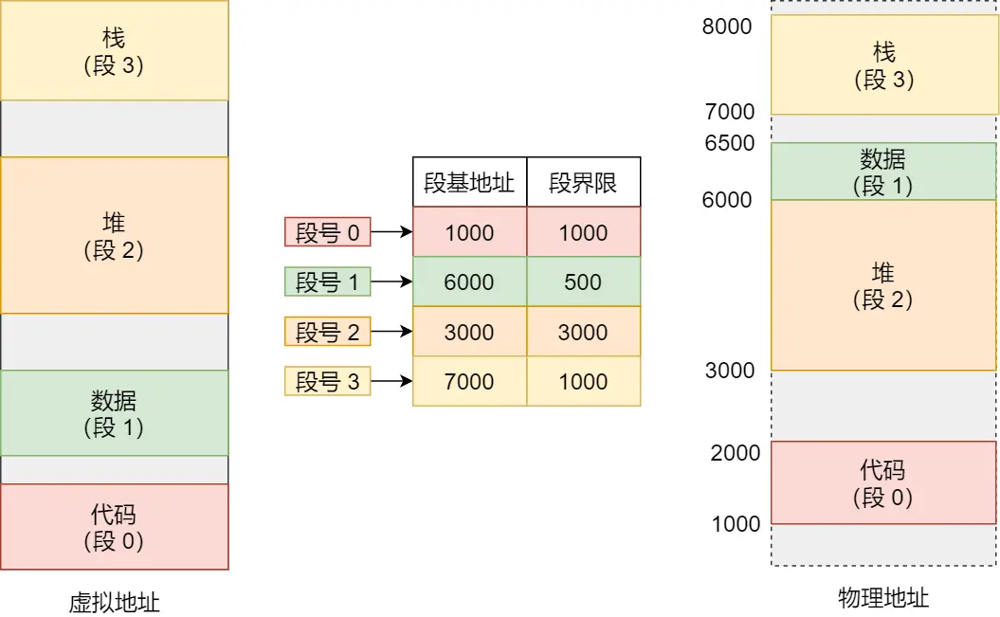

# 内存管理

## 内存碎片

### 内部碎片

内部碎片是由于系统分配给进程的空间大于其所申请的大小，处于（操作系统分配的用于装载某一进程的内存）区域内部或页面内部的存储块，占有这些区域或页面的进程并不使用这个存储块。而在进程占有这块存储块时，系统无法利用它。直到进程释放它，或进程结束时，系统才有可能利用这个存储块。

### 外部碎片

外部碎片指的是还没有被分配出去（不属于任何进程），但由于太小了无法分配给申请内存空间的新进程的内存空闲区域，即处于任何两个已分配区域或页面之间的空闲存储块。这些存储块的总和可以满足当前申请的长度要求，但是由于它们的地址不连续或其他原因，使得系统无法满足当前申请。

## 为什么需要有虚拟内存

如果程序直接访问物理内存，那么要想在内存中同时运行两个程序是不可能的。如果第一个程序在 2000 的位置写入一个新的值，将会擦掉第二个程序存放在相同位置上的所有内容，所以同时运行两个程序是根本行不通的，这两个程序会立刻崩溃。

内存分段和内存分页是操作系统将虚拟地址翻译成物理地址的两种手段。

## 内存分段

分段机制下，虚拟地址如何与物理地址进行映射？

内存分段管理可以做到段根据实际需求分配内存，所以有多少需求就分配多大的段，所以不会出现内部内存碎片。

但是由于每个段的长度不固定，所以多个段未必能恰好使用所有的内存空间，会产生了多个不连续的小物理内存，导致新的程序无法被装载，所以会出现外部内存碎片的问题。

解决「外部内存碎片」的问题就是内存交换。

可以把音乐程序占用的那 256MB 内存写到硬盘上，然后再从硬盘上读回来到内存里。不过再读回的时候，我们不能装载回原来的位置，而是紧紧跟着那已经被占用了的 512MB 内存后面。这样就能空缺出连续的 256MB 空间，于是新的 200MB 程序就可以装载进来。

这个内存交换空间，在 Linux 系统里，也就是我们常看到的 Swap 空间，这块空间是从硬盘划分出来的，用于内存与硬盘的空间交换。

## 内存分页

### 单级页表

为什么单级页表的每一项都需要存在？
> 单级页表可以看成以虚拟地址的虚拟页号作为索引的数组’整个数组的起始地址（物
理地址）存储在页表基地址寄存器中。翻译某个虚拟地址即根据其虚拟页号找到对应的数组项’因此整个页表必须在物理内存中连续’其中没有被用到的数组项也需预
留着（也就是说不能出现空洞）。

### 多级页表

多级页表的设计，可以类比多叉树。总的页表的级数可以对应到树的高度。

每一个页表页也占用物理内存中的—个物理页（4KB）。每个页表项占用8个字节用于存储物理地址和相应的访问权限。故—个页表页包含5l2个页表项（4KB／8≡5l2）。由于5l2项对应于9位（2^9＝5l2），因此虚拟地址中对应于每—级页表的索引都是9位。

4级页表，如果拉满的话，每一级别有512项。那么叶子节点有->512^4项。
每一项代表一个4kb的页面，那么可以表达262144GB的内存。妥妥够用了。

在armV8架构下，一个64位的虚拟地址被划分为如下几个部分：
- 第63至48位:全为0或者全为1（硬件要求）。通常操作系统的选择是’应用程
序使用的虚拟地址的这些位都是0,同时也意味着应用程序的虑拟地址空间大小可以达到2^48 
- 第47至39位:这9位作为该虚拟地址在第0级页表中的索引值’对应于图4ˉ4
中的虚拟页号0°
- 第38至30位:这9位作为该虚拟地址在第l级页表中的索引值’对应于图4ˉ4
中的虚拟页号l。
- 第29至2l位:这9位作为该虚拟地址在第2级页表中的索引值,对应于图4-4
中的虚拟页号2。
- 第20至12位:这9位作为该虚拟地址在第3级页表中的索引值’对应于图4ˉ4
中的虚拟页号3。
- 第11至0位:由于页的大小是4KB所以低l2位代表页内偏移量。

当MMU翻译＿个虚拟地址的时候’首先根据贞表基地址寄存器中的物理地址找
到第0级页表页’然后将虚拟地址的虚拟页号0（第47至39位）作为页表项索引’读取
第0级页表页中的相应页表项;该页表项中存储着下—级（第l级）页表页的物理地址’
MMU按照类似的方式将虚拟地址的虚拟页号l（第38至30位）作为页表项索引’继续
读取第1级页表页中的相应页表项;往下类推’MMU将在—个第3级页表页中的页表
项里面找到该虚拟地址对应的物理页号’再结合虚拟地址中的页内偏移量即可获得最终
的物理地址°

正因为页的大小是4KB，所以虚拟地址的低l2位（2^12＝4KB）对应
于页内偏移量。

分页机制下，虚拟地址如何与物理地址进行映射？

内存分页由于内存空间都是预先划分好的，也就不会像内存分段一样，在段与段之间会产生间隙非常小的内存，这正是分段会产生外部内存碎片的原因。而采用了分页，页与页之间是紧密排列的，所以不会有外部碎片。

但是，因为内存分页机制分配内存的最小单位是一页，即使程序不足一页大小，我们最少只能分配一个页，所以页内会出现内存浪费，所以针对内存分页机制会有内部内存碎片的现象。

