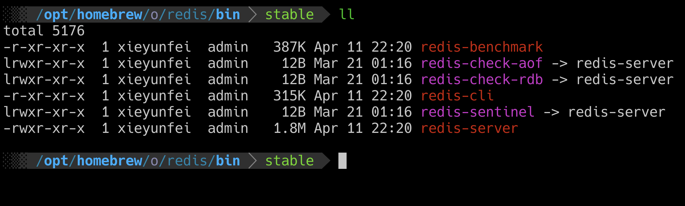
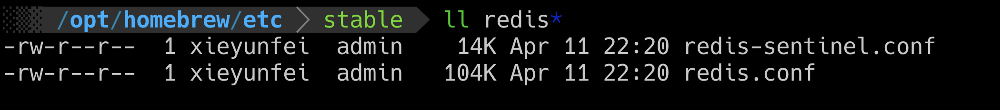
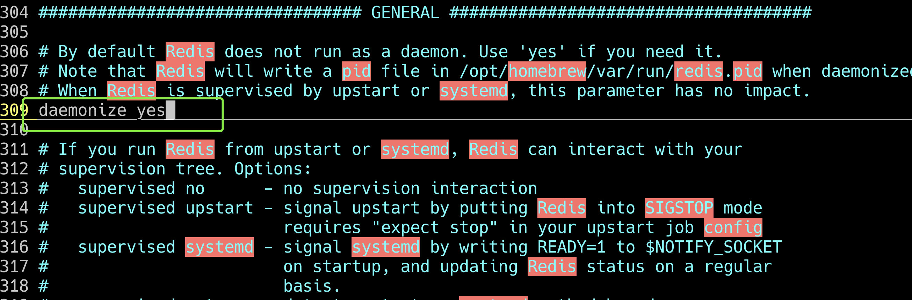

# Redis基础


## 使用场景

### session存在哪儿

web服务，反向代理+集群的部署方式。用户的session存在哪里？


## 其他

### 行式存储与列式存储


## 安装

官网安装指南  
https://redis.io/docs/getting-started/installation/install-redis-on-mac-os/

macos安装方式

```shell
brew install redis
```

二进制文件的目录



配置文件的目录



启动命令  
```shell
./redis-server  /opt/homebrew/etc/redis.conf
```
启动之前，修改配置文件中的后台启动设置。默认是no，修改为yes。



单实例关闭命令  

```shell
redis-cli shutdown
```
使用shutdown可以安全关闭实例

## 相关技术介绍

1. 单线程+IO多路复用（这个知识点后续要搞明白）
2. 单线程操作指的是，不会被线程调度机制打断的操作 


## key键操作

1. 删除操作

```shell
del  key -> 删除指定的key数据

unlink key -> 异步非阻塞删除，先从keyspaces元数据中删除key,真正的删除在后续执行

```

2. 过期时间

```shell
expire key 10 -> 表示设置key的过期时间为10s

ttl  key  -> 查看还有多少秒过期 -1表示永不过期 -2表示已经过期

```

3. 库操作

```shell
select dbnumber -> 选择库 默认是0号库 一共有16个库
flushdb  -> 清空当前库
flushall -> 清空所有库
```

4. key的类型

```shell
type key -> key的类型
```

5. key是否存在

```shell
exists key -> 查看key是否存在
```


## 常用数据类型（value的类型）

到底是key的类型还是value的类型


### string


### hash


### set

### list


### zset(有序集合)