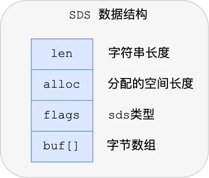
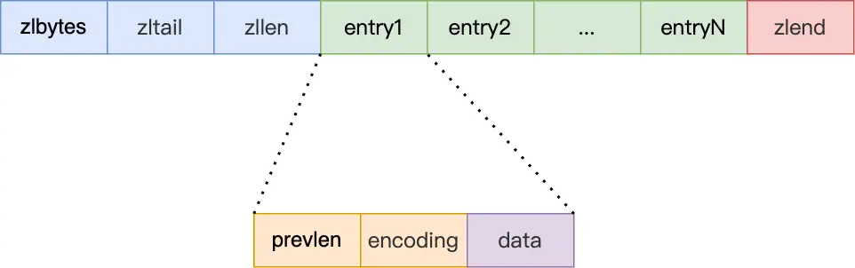
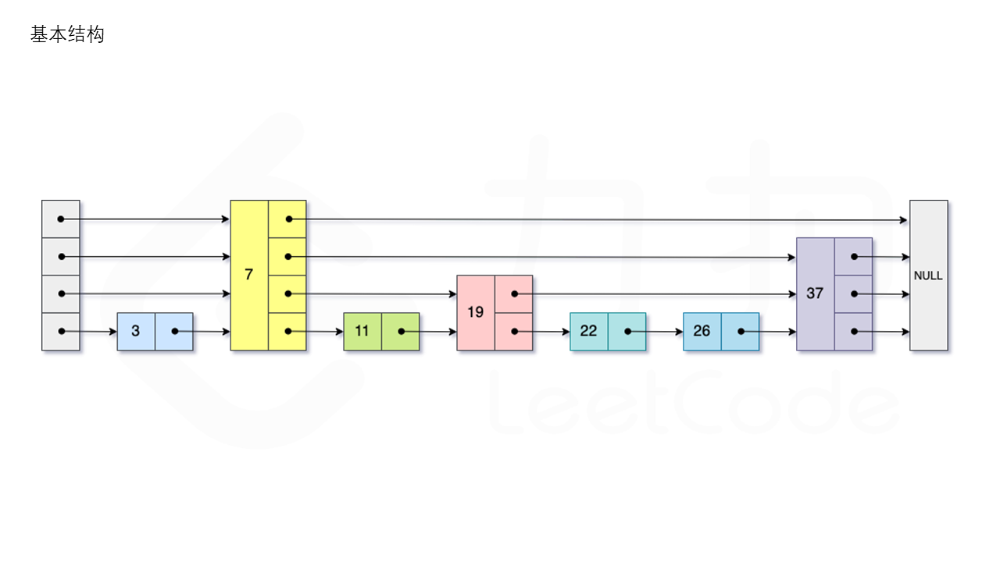

# redis数据结构


Redis 数据结构并不是指 String（字符串）对象、List（列表）对象、Hash（哈希）对象、Set（集合）对象和 Zset（有序集合）对象，因为这些是 Redis 键值对中值的数据类型，也就是数据的保存形式，这些对象的底层实现的方式就用到了数据结构。

Redis 的键值对中的 key 就是字符串对象，而 value 可以是字符串对象，也可以是集合数据类型的对象，比如 List 对象、Hash 对象、Set 对象和 Zset 对象。


## redis如何实现k-v结构

先放着


## string-SDS

字符串底层使用SDS进行存储。
Redis 是用 C 语言实现的，但是它没有直接使用 C 语言的 char* 字符数组来实现字符串，而是自己封装了一个名为简单动态字符串（simple dynamic string，SDS） 的数据结构来表示字符串，也就是 Redis 的 String 数据类型的底层数据结构是 SDS。

1. C字符串使用一个字符数组实现。C 语言获取字符串长度的时间复杂度是 O（N）。
2. 字符串里面不能含有 “\0” 字符，否则最先被程序读入的 “\0” 字符将被误认为是字符串结尾，这个限制使得 C 语言的字符串只能保存文本数据，不能保存像图片、音频、视频文化这样的二进制数据。
3. C语言对字符串的操作是不安全的。程序员不注意，会造成缓冲区溢出。例如，字符串拼接strcat。C 语言的字符串是不会记录自身的缓冲区大小的，所以 strcat 函数假定程序员在执行这个函数时，已经为 dest 分配了足够多的内存，可以容纳 src 字符串中的所有内容，而一旦这个假定不成立，就会发生缓冲区溢出将可能会造成程序运行终止。
   


从图中的关键要素可以看到，SDS的设计和Java的ArrayList的设计思路基本相同。

- len，记录了字符串长度。这样获取字符串长度的时候，只需要返回这个成员变量值就行，时间复杂度只需要 O（1）。
- alloc，分配给字符数组的空间长度。这样在修改字符串的时候，可以通过 alloc - len 计算出剩余的空间大小，可以用来判断空间是否满足修改需求，如果不满足的话，就会自动将 SDS 的空间扩展至执行修改所需的大小，然后才执行实际的修改操作，所以使用 SDS 既不需要手动修改 SDS 的空间大小，也不会出现前面所说的缓冲区溢出的问题。
- flags，用来表示不同类型的 SDS。一共设计了 5 种类型，分别是 sdshdr5、sdshdr8、sdshdr16、sdshdr32 和 sdshdr64，后面在说明区别之处。
- buf[]，字符数组，用来保存实际数据。不仅可以保存字符串，也可以保存二进制数据。


## 双向链表

redis在ListNode的基础上封装了List结构，这样操作起来会更加方便。


list结构的定义大致如下：
```c

typedef struct list {
    //链表头节点
    listNode *head;
    //链表尾节点
    listNode *tail;
    //节点值复制函数
    void *(*dup)(void *ptr);
    //节点值释放函数
    void (*free)(void *ptr);
    //节点值比较函数
    int (*match)(void *ptr, void *key);
    //链表节点数量
    unsigned long len;
} list;

```

redis链表的优点：
- listNode 链表节点的结构里带有 prev 和 next 指针，获取某个节点的前置节点或后置节点的时间复杂度只需O(1)，而且这两个指针都可以指向 NULL，所以链表是无环链表；
- list 结构因为提供了表头指针 head 和表尾节点 tail，所以获取链表的表头节点和表尾节点的时间复杂度只需O(1)；
- list 结构因为提供了链表节点数量 len，所以获取链表中的节点数量的时间复杂度只需O(1)；
- listNode 链表节使用 void* 指针保存节点值，并且可以通过 list 结构的 dup、free、match 函数指针为节点设置该节点类型特定的函数，因此链表节点可以保存各种不同类型的值；


redis链表的缺点
- 链表每个节点之间的内存都是不连续的，意味着无法很好利用 CPU 缓存。能很好利用 CPU 缓存的数据结构就是数组，因为数组的内存是连续的，这样就可以充分利用 CPU 缓存来加速访问。
- 还有一点，保存一个链表节点的值都需要一个链表节点结构头的分配，内存开销较大。


## 压缩列表

压缩列表是 Redis 为了节约内存而开发的，它是由连续内存块组成的顺序型数据结构，有点类似于数组。

它曾经是hash、zset、list底层使用的数据结构。

压缩列表在表头有三个字段：

- zlbytes，记录整个压缩列表占用对内存字节数；
- zltail，记录压缩列表「尾部」节点距离起始地址由多少字节，也就是列表尾的偏移量；
- zllen，记录压缩列表包含的节点数量；
- zlend，标记压缩列表的结束点，固定值 0xFF（十进制255）。
  
在压缩列表中，如果我们要查找定位第一个元素和最后一个元素，可以通过表头三个字段（zllen）的长度直接定位，复杂度是 O(1)。而查找其他元素时，就没有这么高效了，只能逐个查找，此时的复杂度就是 O(N) 了，因此压缩列表不适合保存过多的元素。


压缩列表节点包含三部分内容：

- prevlen，记录了「前一个节点」的长度，目的是为了实现从后向前遍历；
- encoding，记录了当前节点实际数据的「类型和长度」，类型主要有两种：字符串和整数。
- data，记录了当前节点的实际数据，类型和长度都由 encoding 决定；
当我们往压缩列表中插入数据时，压缩列表就会根据数据类型是字符串还是整数，以及数据的大小，会使用不同空间大小的 prevlen 和 encoding 这两个元素里保存的信息，这种根据数据大小和类型进行不同的空间大小分配的设计思想，正是 Redis 为了节省内存而采用的。


## 哈希表

Redis 采用了「链式哈希」来解决哈希冲突，在不扩容哈希表的前提下，将具有相同哈希值的数据串起来，形成链接起，以便这些数据在表中仍然可以被查询到。

哈希表的设计结构如下：
```c
typedef struct dictht {
    //哈希表数组
    dictEntry **table;
    //哈希表大小
    unsigned long size;  
    //哈希表大小掩码，用于计算索引值
    unsigned long sizemask;
    //该哈希表已有的节点数量
    unsigned long used;
} dictht;

```

dictht存储了哈希表的元数据信息。
通过它可以找打哈希表的结构。
哈希表的每个槽位使用链表存储具体的值。


因为dictht中没有存储指向链表尾部节点的指针。
因此，redis在处理哈希冲突时，对新加入的节点采用”头插法“。


链表处理hash冲突的缺点是，当某个槽位的链表的长度过长时，查询这个位置的元素耗时会明显增加。

reHash操作


## 整数集合

set的底层实现有两个，一个是hash表，另外一个就是整数集合。
当一个 Set 对象只包含整数值元素，并且元素数量不大时，就会使用整数集这个数据结构作为底层实现。

```shell
127.0.0.1:6379> sadd myset  1 2 3 4 5
(integer) 5
127.0.0.1:6379> object encoding myset
"intset"
127.0.0.1:6379>
```


整数集合本质上是一块连续内存空间，它的结构定义如下：
```c
typedef struct intset {
    //编码方式
    uint32_t encoding;
    //集合包含的元素数量
    uint32_t length;
    //保存元素的数组
    int8_t contents[];
} intset;
```

可以看到，保存元素的容器是一个 contents 数组，虽然 contents 被声明为 int8_t 类型的数组，但是实际上 contents 数组并不保存任何 int8_t 类型的元素，contents 数组的真正类型取决于 intset 结构体里的 encoding 属性的值。比如：

如果 encoding 属性值为 INTSET_ENC_INT16，那么 contents 就是一个 int16_t 类型的数组，数组中每一个元素的类型都是 int16_t；
如果 encoding 属性值为 INTSET_ENC_INT32，那么 contents 就是一个 int32_t 类型的数组，数组中每一个元素的类型都是 int32_t；
如果 encoding 属性值为 INTSET_ENC_INT64，那么 contents 就是一个 int64_t 类型的数组，数组中每一个元素的类型都是 int64_t；
不同类型的 contents 数组，意味着数组的大小也会不同。


**这里有一点疑惑，C语言是静态类型语言。升级了contents的类型，整个结构不就不符合intset的结构了吗？**
为了理解这里面的细节，从github上找到了redis相关的代码：
从_intsetSet这个函数可以看到，它对contents数组进行了强制类型转换。


```c
/* Upgrades the intset to a larger encoding and inserts the given integer. */
static intset *intsetUpgradeAndAdd(intset *is, int64_t value) {
    uint8_t curenc = intrev32ifbe(is->encoding);
    uint8_t newenc = _intsetValueEncoding(value);
    int length = intrev32ifbe(is->length);
    int prepend = value < 0 ? 1 : 0;

    /* First set new encoding and resize */
    is->encoding = intrev32ifbe(newenc);
    is = intsetResize(is,intrev32ifbe(is->length)+1);

    /* Upgrade back-to-front so we don't overwrite values.
     * Note that the "prepend" variable is used to make sure we have an empty
     * space at either the beginning or the end of the intset. */
    while(length--)
        _intsetSet(is,length+prepend,_intsetGetEncoded(is,length,curenc));

    /* Set the value at the beginning or the end. */
    if (prepend)
        _intsetSet(is,0,value);
    else
        _intsetSet(is,intrev32ifbe(is->length),value);
    is->length = intrev32ifbe(intrev32ifbe(is->length)+1);
    return is;
}


/* Set the value at pos, using the configured encoding. */
static void _intsetSet(intset *is, int pos, int64_t value) {
    uint32_t encoding = intrev32ifbe(is->encoding);

    if (encoding == INTSET_ENC_INT64) {
        ((int64_t*)is->contents)[pos] = value;
        memrev64ifbe(((int64_t*)is->contents)+pos);
    } else if (encoding == INTSET_ENC_INT32) {
        ((int32_t*)is->contents)[pos] = value;
        memrev32ifbe(((int32_t*)is->contents)+pos);
    } else {
        ((int16_t*)is->contents)[pos] = value;
        memrev16ifbe(((int16_t*)is->contents)+pos);
    }
}

```

数组的升级操作如下：


## 跳跃表

Redis 只有 Zset 对象的底层实现用到了跳表，跳表的优势是能支持平均 O(logN) 复杂度的节点查找。

```c
typedef struct zset {
    dict *dict;
    zskiplist *zsl;
} zset;
```

Zset 对象在执行数据插入或是数据更新的过程中，会依次在跳表和哈希表中插入或更新相应的数据，从而保证了跳表和哈希表中记录的信息一致。

Zset 对象能支持范围查询（如 ZRANGEBYSCORE 操作），这是因为它的数据结构设计采用了跳表，而又能以常数复杂度获取元素权重（如 ZSCORE 操作），这是因为它同时采用了哈希表进行索引。

Zset 对象在使用跳表作为数据结构的时候，是使用由「哈希表+跳表」组成的 struct zset，但是我们讨论的时候，都会说跳表是 Zset 对象的底层数据结构，而不会提及哈希表，是因为 struct zset 中的哈希表只是用于以常数复杂度获取元素权重，大部分操作都是跳表实现的。




leetcode1206是一道跳跃表实现的问题。
https://leetcode.cn/problems/design-skiplist/description/?orderBy=most_votes&languageTags=golang

跳表在进行查找时，首先从当前的最高层 L(n)L(n)L(n) 层开始查找，在当前层水平地逐个比较直至当前节点的下一个节点大于等于目标节点，然后移动至下一层进行查找，重复这个过程直至到达第一层。此时，若下一个节点是目标节点，则成功查找；反之，则元素不存在。由于从高层往低层开始查找，由于低层出现的元素可能不会出现在高层，因此跳表在进行查找的过程中会跳过一些元素，相比于有序链表的查询，跳表的查询速度会更快


## quicklist

quicklist是redis中list的底层数据结构。


它是一个双向链表。并且链表的每一个元素都是一个压缩列表。
每一个压缩列表可以存储一定数量的元素。
这是对性能和存储效率上的一个折中。


## listpack

listpack是redis中hash和zset的底层数据结构之一。
先放着。


