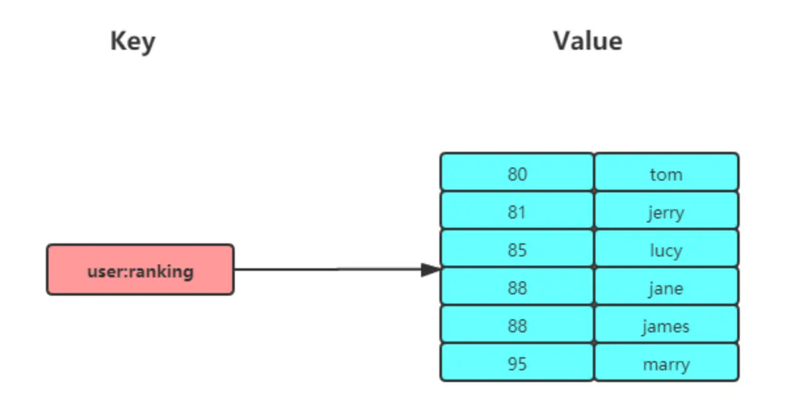
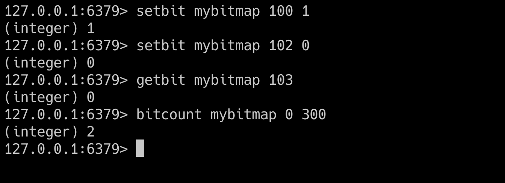

# redis数据类型

## string

String 是最基本的 key-value 结构，key 是唯一标识（这个标识肯定是字符串），value 是具体的值，value其实不仅是字符串， 也可以是数字（整数或浮点数），value 最多可以容纳的数据长度是 512M。

### string常用指令

string 为代表的key-value 键值对 key肯定是字符串，value可以是字符串或者是数字。


普通字符串基本操作

```shell

# 设置 key-value 类型的值
> SET name lin
OK
# 根据 key 获得对应的 value
> GET name
"lin"
# 判断某个 key 是否存在
> EXISTS name
(integer) 1
# 返回 key 所储存的字符串值的长度
> STRLEN name
(integer) 3
# 删除某个 key 对应的值
> DEL name
(integer) 1

```

批量设置 mset mget

```shell

# 批量设置 key-value 类型的值
> MSET key1 value1 key2 value2 
OK
# 批量获取多个 key 对应的 value
> MGET key1 key2 
1) "value1"
2) "value2"

```

计数器

```shell
# 设置 key-value 类型的值
> SET number 0
OK
# 将 key 中储存的数字值增一
> INCR number
(integer) 1
# 将key中存储的数字值加 10
> INCRBY number 10
(integer) 11
# 将 key 中储存的数字值减一
> DECR number
(integer) 10
# 将key中存储的数字值键 10
> DECRBY number 10
(integer) 0

```

过期（默认为永不过期）：

```shell

# 设置 key 在 60 秒后过期（该方法是针对已经存在的key设置过期时间）
> EXPIRE name  60 
(integer) 1
# 查看数据还有多久过期
> TTL name 
(integer) 51

#设置 key-value 类型的值，并设置该key的过期时间为 60 秒
> SET key  value EX 60
OK
> SETEX key  60 value2
OK

```

Redis SETEX 命令为指定的 key 设置值及其过期时间。如果 key 已经存在， SETEX 命令将会替换旧的值。

不存在就插入

```shell

# 不存在就插入（not exists）
>SETNX key value
(integer) 1

```


### 应用场景

#### 缓存对象

使用 String 来缓存对象有两种方式：

- 直接缓存整个对象的 JSON，命令例子： SET user:1 '{"name":"xiaolin", "age":18}'。
- 采用将 key 进行分离为 user:ID:属性，采用 MSET 存储，用 MGET 获取各属性值，命令例子： MSET user:1:name xiaolin user:1:age 18 user:2:name xiaomei user:2:age 20。

提取的这个功能还挺强的。


#### 常规计数
因为 Redis 处理命令是单线程，所以执行命令的过程是原子的。因此 String 数据类型适合计数场景，比如计算访问次数、点赞、转发、库存数量等等。

比如计算文章的阅读量：
```shell
# 初始化文章的阅读量
> SET aritcle:readcount:1001 0
OK
#阅读量+1
> INCR aritcle:readcount:1001
(integer) 1
#阅读量+1
> INCR aritcle:readcount:1001
(integer) 2
#阅读量+1
> INCR aritcle:readcount:1001
(integer) 3
# 获取对应文章的阅读量
> GET aritcle:readcount:1001
"3"

```

#### 分布式锁

SET 命令有个 NX 参数可以实现「key不存在才插入」，可以用它来实现分布式锁：

如果 key 不存在，则显示插入成功，可以用来表示加锁成功；
如果 key 存在，则会显示插入失败，可以用来表示加锁失败。
一般而言，还会对分布式锁加上过期时间，分布式锁的命令如下：

```shell
SET lock_key unique_value NX PX 10000
```
NX表示表示lock_key不存在，才对lock_key进行设置操作。
PX 10000表示过期时间为10s （单位是毫秒）

解锁的过程就是将lock_key删除，但是不能乱删除。
解锁需要加锁的客户端进行解锁。因此，解锁需要先判断操作解锁的客户端是否是加锁的客户端。
如果是加锁的客户端，才执行删除操作。


#### 共享session

通常我们在开发后台管理系统时，会使用 Session 来保存用户的会话(登录)状态，这些 Session 信息会被保存在服务器端，但这只适用于单系统应用，如果是分布式系统此模式将不再适用。

例如用户一的 Session 信息被存储在服务器一，但第二次访问时用户一被分配到服务器二，这个时候服务器并没有用户一的 Session 信息，就会出现需要重复登录的问题，问题在于分布式系统每次会把请求随机分配到不同的服务器。

因此，我们需要借助 Redis 对这些 Session 信息进行统一的存储和管理，这样无论请求发送到那台服务器，服务器都会去同一个 Redis 获取相关的 Session 信息，这样就解决了分布式系统下 Session 存储的问题。


## List

List 列表是简单的字符串列表，按照插入顺序排序，可以从头部或尾部向 List 列表添加元素。
列表的最大长度为 2^32 - 1，也即每个列表支持超过 40 亿个元素。

### List 常用命令

操作list可以像操作一个双端队列一样。  
下面的命令中，key表示list的名称。

```shell
# 将一个或多个值value插入到key列表的表头(最左边)，最后的值在最前面
LPUSH key value [value ...] 
# 将一个或多个值value插入到key列表的表尾(最右边)
RPUSH key value [value ...]
# 移除并返回key列表的头元素
LPOP key     
# 移除并返回key列表的尾元素
RPOP key 

# 返回列表key中指定区间内的元素，区间以偏移量start和stop指定，从0开始
LRANGE key start stop

# 从key列表表头弹出一个元素，没有就阻塞timeout秒，如果timeout=0则一直阻塞
BLPOP key [key ...] timeout
# 从key列表表尾弹出一个元素，没有就阻塞timeout秒，如果timeout=0则一直阻塞
BRPOP key [key ...] timeout

```


### 应用场景

#### 消息队列

消息队列在存取消息时，必须要满足三个需求，分别是消息保序、处理重复的消息和保证消息可靠性。

**消息有序**

生产者从一端push，消费者从另外一端pop，自然可以做到有序。
- 生产者使用 LPUSH key value[value...] 将消息插入到队列的头部，如果 key 不存在则会创建一个空的队列再插入消息。
- 消费者使用 RPOP key 依次读取队列的消息，先进先出。


**处理重复的数据**

消费者要实现重复消息的判断，需要 2 个方面的要求：
- 每个消息都有一个全局的 ID。
- 消费者要记录已经处理过的消息的 ID。当收到一条消息后，消费者程序就可以对比收到的消息 ID 和记录的已处理过的消息 ID，来判断当前收到的消息有没有经过处理。如果已经处理过，那么，消费者程序就不再进行处理了。

```shell
LPUSH mq "111000102:stock:99"
(integer) 1
```
在消息体中自己包含上全局ID，由消费者处理。


**消息可靠性**

当消费者程序从 List 中读取一条消息后，List 就不会再留存这条消息了。所以，如果消费者程序在处理消息的过程出现了故障或宕机，就会导致消息没有处理完成，那么，消费者程序再次启动后，就没法再次从 List 中读取消息了。

为了留存消息，List 类型提供了 BRPOPLPUSH 命令，这个命令的作用是让消费者程序从一个 List 中读取消息，同时，Redis 会把这个消息再插入到另一个 List（可以叫作备份 List）留存。

这样一来，如果消费者程序读了消息但没能正常处理，等它重启后，就可以从备份 List 中重新读取消息并进行处理了。


List作为消息队列的缺陷：

List 不支持多个消费者消费同一条消息，因为一旦消费者拉取一条消息后，这条消息就从 List 中删除了，无法被其它消费者再次消费。

要实现一条消息可以被多个消费者消费，那么就要将多个消费者组成一个消费组，使得多个消费者可以消费同一条消息，但是 List 类型并不支持消费组的实现。


## Hash

Hash有点像一个微缩版的redis。
Hash 是一个键值对（key - value）集合，其中 value 的形式如： value=[{field1，value1}，...{fieldN，valueN}]。Hash 特别适合用于存储对象。

### 常用命令

下面的命令中，哈希表的名称是key。
```shell

# 存储一个哈希表key的键值
HSET key field value   
# 获取哈希表key对应的field键值
HGET key field

# 在一个哈希表key中存储多个键值对
HMSET key field value [field value...] 
# 批量获取哈希表key中多个field键值
HMGET key field [field ...]       
# 删除哈希表key中的field键值
HDEL key field [field ...]    

# 返回哈希表key中field的数量
HLEN key       
# 返回哈希表key中所有的键值
HGETALL key 

# 为哈希表key中field键的值加上增量n
HINCRBY key field n   

```


### 应用场景

#### 缓存对象

在介绍 String 类型的应用场景时有所介绍，String + Json也是存储对象的一种方式，那么存储对象时，到底用 String + json 还是用 Hash 呢？

一般对象用 String + Json 存储，对象中某些频繁变化的属性可以考虑抽出来用 Hash 类型存储。


#### 购物车


## Set

Set 类型是一个无序并唯一的键值集合，它的存储顺序不会按照插入的先后顺序进行存储。
一个集合最多可以存储 2^32-1 个元素。概念和数学中个的集合基本类似，可以交集，并集，差集等等，所以 Set 类型除了支持集合内的增删改查，同时还支持多个集合取交集、并集、差集。

Set 类型和 List 类型的区别如下：
- List 可以存储重复元素，Set 只能存储非重复元素；
- List 是按照元素的先后顺序存储元素的，而 Set 则是无序方式存储元素的。


### 常用命令


set 常用操作
```shell

# 往集合key中存入元素，元素存在则忽略，若key不存在则新建
SADD key member [member ...]
# 从集合key中删除元素
SREM key member [member ...] 
# 获取集合key中所有元素
SMEMBERS key
# 获取集合key中的元素个数
SCARD key

# 判断member元素是否存在于集合key中
SISMEMBER key member

# 从集合key中随机选出count个元素，元素不从key中删除
SRANDMEMBER key [count]
# 从集合key中随机选出count个元素，元素从key中删除
SPOP key [count]

```

集合操作

```shell
# 交集运算
SINTER key [key ...]
# 将交集结果存入新集合destination中
SINTERSTORE destination key [key ...]

# 并集运算
SUNION key [key ...]
# 将并集结果存入新集合destination中
SUNIONSTORE destination key [key ...]

# 差集运算
SDIFF key [key ...]
# 将差集结果存入新集合destination中
SDIFFSTORE destination key [key ...]

```

### 应用场景

Set 类型比较适合用来数据去重和保障数据的唯一性，还可以用来统计多个集合的交集、错集和并集等，当我们存储的数据是无序并且需要去重的情况下，比较适合使用集合类型进行存储。

Set 的差集、并集和交集的计算复杂度较高，在数据量较大的情况下，如果直接执行这些计算，会导致 Redis 实例阻塞。

在主从集群中，为了避免主库因为 Set 做聚合计算（交集、差集、并集）时导致主库被阻塞，我们可以选择一个从库完成聚合统计，或者把数据返回给客户端，由客户端来完成聚合统计。


#### 点赞

Set 类型可以保证一个用户只能点一个赞，这里举例子一个场景，key 是文章id，value 是用户id。

uid:1 、uid:2、uid:3 三个用户分别对 article:1 文章点赞了。
```shell
# uid:1 用户对文章 article:1 点赞
> SADD article:1 uid:1
(integer) 1
# uid:2 用户对文章 article:1 点赞
> SADD article:1 uid:2
(integer) 1
# uid:3 用户对文章 article:1 点赞
> SADD article:1 uid:3
(integer) 1
```


uid:1 取消了对 article:1 文章点赞。
```shell
> SREM article:1 uid:1
(integer) 1
```

获取 article:1 文章所有点赞用户 :
```shell
> SMEMBERS article:1
1) "uid:3"
2) "uid:2"
```

获取 article:1 文章的点赞用户数量：
```shell
> SCARD article:1
(integer) 2
```

判断用户 uid:1 是否对文章 article:1 点赞了：
```shell
> SISMEMBER article:1 uid:1
(integer) 0  # 返回0说明没点赞，返回1则说明点赞了
```


#### 共同关注

Set 类型支持交集运算，所以可以用来计算共同关注的好友、公众号等。

key 可以是用户id，value 则是已关注的公众号的id。

uid:1 用户关注公众号 id 为 5、6、7、8、9，uid:2 用户关注公众号 id 为 7、8、9、10、11。
```shell
# uid:1 用户关注公众号 id 为 5、6、7、8、9
> SADD uid:1 5 6 7 8 9
(integer) 5
# uid:2  用户关注公众号 id 为 7、8、9、10、11
> SADD uid:2 7 8 9 10 11
(integer) 5
```

uid:1 和 uid:2 共同关注的公众号：
```shell
# 获取共同关注
> SINTER uid:1 uid:2
1) "7"
2) "8"
3) "9"
```

给 uid:2 推荐 uid:1 关注的公众号：
```shell
> SDIFF uid:1 uid:2
1) "5"
2) "6"
```

验证某个公众号是否同时被 uid:1 或 uid:2 关注:
```shell
> SISMEMBER uid:1 5
(integer) 1 # 返回1，说明关注了
> SISMEMBER uid:2 5
(integer) 0 # 返回0，说明没关注
```

#### 抽奖活动

存储某活动中中奖的用户名 ，Set 类型因为有去重功能，可以保证同一个用户不会中奖两次。
key为抽奖活动名，value为员工名称，把所有员工名称放入抽奖箱 ：

```shell
>SADD lucky Tom Jerry John Sean Marry Lindy Sary Mark
(integer) 5
```

如果允许重复中奖，可以使用 SRANDMEMBER 命令。
```shell
# 抽取 1 个一等奖：
> SRANDMEMBER lucky 1
1) "Tom"
# 抽取 2 个二等奖：
> SRANDMEMBER lucky 2
1) "Mark"
2) "Jerry"
# 抽取 3 个三等奖：
> SRANDMEMBER lucky 3
1) "Sary"
2) "Tom"
3) "Jerry"
```


如果不允许重复中奖，可以使用 SPOP 命令。
```shell
# 抽取一等奖1个
> SPOP lucky 1
1) "Sary"
# 抽取二等奖2个
> SPOP lucky 2
1) "Jerry"
2) "Mark"
# 抽取三等奖3个
> SPOP lucky 3
1) "John"
2) "Sean"
3) "Lindy"
```


## Zset

Zset 类型（有序集合类型）相比于 Set 类型多了一个排序属性 score（分值），对于有序集合 ZSet 来说，每个存储元素相当于有两个值组成的，一个是有序集合的元素值，一个是排序值。有序集合保留了集合不能有重复成员的特性（分值可以重复），但不同的是，有序集合中的元素可以排序。



### Zset常用命令

在下面的命令中，key是Zset的名字。
```shell
# 往有序集合key中加入带分值元素
ZADD key score member [[score member]...]   
# 往有序集合key中删除元素
ZREM key member [member...]                 
# 返回有序集合key中元素member的分值
ZSCORE key member
# 返回有序集合key中元素个数
ZCARD key 

# 为有序集合key中元素member的分值加上increment
ZINCRBY key increment member 

# 正序获取有序集合key从start下标到stop下标的元素
ZRANGE key start stop [WITHSCORES]
# 倒序获取有序集合key从start下标到stop下标的元素
ZREVRANGE key start stop [WITHSCORES]

# 返回有序集合中指定分数区间内的成员，分数由低到高排序。
ZRANGEBYSCORE key min max [WITHSCORES] [LIMIT offset count]

# 返回指定成员区间内的成员，按字典正序排列, 分数必须相同。
ZRANGEBYLEX key min max [LIMIT offset count]
# 返回指定成员区间内的成员，按字典倒序排列, 分数必须相同
ZREVRANGEBYLEX key max min [LIMIT offset count]

```


zset集合之间的操作


```shell
# 并集计算(相同元素分值相加)，numberkeys一共多少个key，WEIGHTS每个key对应的分值乘积
ZUNIONSTORE destkey numberkeys key [key...] 
# 交集计算(相同元素分值相加)，numberkeys一共多少个key，WEIGHTS每个key对应的分值乘积
ZINTERSTORE destkey numberkeys key [key...]

```


### 应用场景

Zset 类型（Sorted Set，有序集合） 可以根据元素的权重来排序，我们可以自己来决定每个元素的权重值。比如说，我们可以根据元素插入 Sorted Set 的时间确定权重值，先插入的元素权重小，后插入的元素权重大。
在面对需要展示最新列表、排行榜等场景时，如果数据更新频繁或者需要分页显示，可以优先考虑使用 Sorted Set。


#### 排行榜

有序集合比较典型的使用场景就是排行榜。例如学生成绩的排名榜、游戏积分排行榜、视频播放排名、电商系统中商品的销量排名等。
以博文点赞排名为例，五篇博文，分别获得赞为 200、40、100、50、150。
```shell
# arcticle:1 文章获得了200个赞
> ZADD user:xiaolin:ranking 200 arcticle:1
(integer) 1
# arcticle:2 文章获得了40个赞
> ZADD user:xiaolin:ranking 40 arcticle:2
(integer) 1
# arcticle:3 文章获得了100个赞
> ZADD user:xiaolin:ranking 100 arcticle:3
(integer) 1
# arcticle:4 文章获得了50个赞
> ZADD user:xiaolin:ranking 50 arcticle:4
(integer) 1
# arcticle:5 文章获得了150个赞
> ZADD user:xiaolin:ranking 150 arcticle:5
(integer) 1

```

文章 arcticle:4 新增一个赞，可以使用 ZINCRBY 命令（为有序集合key中元素member的分值加上increment）：

```shell
ZINCRBY user:xiaolin:ranking 1 arcticle:4
"51"
```
查看某篇文章的点赞数量

```shell
ZSCORE user:xiaolin:ranking arcticle:4
"50
```

获取点赞数量最多的3篇文章：
0 2表示名次
```shell
# WITHSCORES 表示把 score 也显示出来
ZREVRANGE user:xiaolin:ranking 0 2 WITHSCORES
1) "arcticle:1"
2) "200"
3) "arcticle:5"
4) "150"
5) "arcticle:3"
6) "100"
```

#### 电话号码、姓名排序

使用有序集合的 ZRANGEBYLEX 或 ZREVRANGEBYLEX 可以帮助我们实现电话号码或姓名的排序，我们以 ZRANGEBYLEX （返回指定成员区间内的成员，按 key 正序排列，分数必须相同）为例。
注意：不要在分数不一致的 SortSet 集合中去使用 ZRANGEBYLEX和 ZREVRANGEBYLEX 指令，因为获取的结果会不准确。

电话排序

将电话号码存储到zset中，然后根据需要获得号段

```shell
> ZADD phone 0 13100111100 0 13110114300 0 13132110901 
(integer) 3
> ZADD phone 0 13200111100 0 13210414300 0 13252110901 
(integer) 3
> ZADD phone 0 13300111100 0 13310414300 0 13352110901 
(integer) 3
```

获取所有的号码
- , + 表示从负无穷到正无穷
```shell
ZRANGEBYLEX phone - + 
```

获取132号段
[ 和  （ 应该是区间表示方法
```shell
ZRANGEBYLEX phone [132 (133
```

获取132、133号码段

```shell
ZRANGEBYLEX phone [132 (134

```

姓名排序

```shell
zadd names 0 Toumas 0 Jake 0 Bluetuo 0 Gaodeng 0 Aimini 0 Aidehua 
```

获取所有人的名字
```shell
ZRANGEBYLEX names - +
```

获取名字中大写字母A开头的所有人：

```shell
ZRANGEBYLEX names [A (B
```

获取名字中大写字母 C 到 Z 的所有人：
```shell
ZRANGEBYLEX names [C [Z
```


## BitMap

Bitmap，即位图，是一串连续的二进制数组（0和1），可以通过偏移量（offset）定位元素。BitMap通过最小的单位bit来进行0|1的设置，表示某个元素的值或者状态，时间复杂度为O(1)。BitMap可以看做是一个Bit数组。
这个数组的长度有多大呢？？？ 

比如，我需要设置的bit位都在1w位以后，这样前面的bit位不就很浪费吗？（这种情况感觉还是好解决的，使用偏移量）  
它应该不适用数据稀疏的情况。

### BitMap常用命令

bit位默认都是0，它没有空值。bit位的下标编号也是从0开始。

```shell
# 设置值，其中value只能是 0 和 1
SETBIT key offset value

# 获取值
GETBIT key offset

# 获取指定范围内值为 1 的个数
# start 和 end 以字节为单位
BITCOUNT key start end

```


bitmap运算操作

```shell

// 需要再看

```


### 应用场景

Bitmap 类型非常适合二值状态统计的场景，这里的二值状态就是指集合元素的取值就只有 0 和 1 两种，在记录海量数据时，Bitmap 能够有效地节省内存空间。

#### 签到

在签到打卡的场景中，我们只用记录签到（1）或未签到（0），所以它就是非常典型的二值状态。

执行下面的命令，记录该用户 6 月 3 号已签到
```shell
SETBIT uid:sign:100:202206 2 1

```
检查该用户 6 月 3 日是否签到。

```shell
GETBIT uid:sign:100:202206 2 
```

统计用户在6月份签到的次数

```shell
BITCOUNT uid:sign:100:202206
```

Redis 提供了 BITPOS key bitValue [start] [end]指令，返回数据表示 Bitmap 中第一个值为 bitValue 的 offset 位置。

在默认情况下， 命令将检测整个位图， 用户可以通过可选的 start 参数和 end 参数指定要检测的范围。所以我们可以通过执行这条命令来获取 userID = 100 在 2022 年 6 月份首次打卡日期：
```shell
BITPOS uid:sign:100:202206 1
```

判断用户的登录状态

Bitmap 提供了 GETBIT、SETBIT 操作，通过一个偏移值 offset 对 bit 数组的 offset 位置的 bit 位进行读写操作，需要注意的是 offset 从 0 开始。

只需要一个 key = login_status 表示存储用户登陆状态集合数据， 将用户 ID 作为 offset，在线就设置为 1，下线设置 0。通过 GETBIT判断对应的用户是否在线。 5000 万用户只需要 6 MB 的空间。

第一步，执行以下指令，表示用户已登录。
```shell
SETBIT login_status 10086 1
```

第二步，检查该用户是否登陆，返回值 1 表示已登录。
```shell
GETBIT login_status 10086
```
第三步，登出，将 offset 对应的 value 设置成 0。
```shell
SETBIT login_status 10086 0
```

连续签到用户数量

比如，统计连续3天签到的用户数量。
我们把每天的日期作为 Bitmap 的 key，userId 作为 offset，若是打卡则将 offset 位置的 bit 设置成 1。

key 对应的集合的每个 bit 位的数据则是一个用户在该日期的打卡记录。

一共有3个这样的 Bitmap，如果我们能对这3个Bitmap 的对应的 bit 位做 『与』运算。同样的 UserID offset 都是一样的，当一个 userID 在3个 Bitmap 对应对应的 offset 位置的 bit = 1 就说明该用户3天连续打卡。

结果保存到一个新 Bitmap 中，我们再通过 BITCOUNT 统计 bit = 1 的个数便得到了连续打卡3天的用户总数了。

```shell
# 与操作
BITOP AND destmap bitmap:01 bitmap:02 bitmap:03
# 统计 bit 位 =  1 的个数
BITCOUNT destmap
```


## HyperLogLog

hyperLoglog是一种用于「统计基数」的数据集合类型，基数统计就是指统计一个集合中不重复的元素个数。
但要注意，HyperLogLog 是统计规则是基于概率完成的，不是非常准确，标准误算率是 0.81%。

关于hyperLogLog的讲解可以在下面这篇文章中阅读。
https://engineering.fb.com/2018/12/13/data-infrastructure/hyperloglog/


HyperLogLog 的优点是，在输入元素的数量或者体积非常非常大时，计算基数所需的内存空间总是固定的、并且是很小的。

在 Redis 里面，每个 HyperLogLog 键只需要花费 12 KB 内存，就可以计算接近 2^64 个不同元素的基数，和元素越多就越耗费内存的 Set 和 Hash 类型相比，HyperLogLog 就非常节省空间。

这什么概念？举个例子给大家对比一下。

用 Java 语言来说，一般 long 类型占用 8 字节，而 1 字节有 8 位，即：1 byte = 8 bit，即 long 数据类型最大可以表示的数是：2^63-1。对应上面的2^64个数，假设此时有2^63-1这么多个数，从 0 ~ 2^63-1，按照long以及1k = 1024 字节的规则来计算内存总数，就是：((2^63-1) * 8/1024)K，这是很庞大的一个数，存储空间远远超过12K，而 HyperLogLog 却可以用 12K 就能统计完。


### hyperLogLog常用命令

一共就3个命令
1. 将某个元素添加到某个hyperLogLog中
2. 统计某个hyperLogLog中的元素数量
3. 合并多个hyperLogLog
key是给当前hyperLogLog起的名称

```shell
# 添加指定元素到 HyperLogLog 中
PFADD key element [element ...]

# 返回给定 HyperLogLog 的基数估算值。
PFCOUNT key [key ...]

# 将多个 HyperLogLog 合并为一个 HyperLogLog
PFMERGE destkey sourcekey [sourcekey ...]

```

### 应用场景

#### 百万级网页 UV 计数
PV是指页面访问量，即Page View，用户每次对网站的访问均被记录，用户对同一页面的多次访问，是访问量的累计。 UV是指独立访问用户数，即Unique Visitor，访问网站的一台电脑客户端为一个访客，根据IP地址来区分访客数

redis HyperLogLog 优势在于只需要花费 12 KB 内存，就可以计算接近 2^64 个元素的基数，和元素越多就越耗费内存的 Set 和 Hash 类型相比，HyperLogLog 就非常节省空间。所以，非常适合统计百万级以上的网页 UV 的场景。

在统计 UV 时，你可以用 PFADD 命令（用于向 HyperLogLog 中添加新元素）把访问页面的每个用户都添加到 HyperLogLog 中。
```shell
PFADD page1:uv user1 user2 user3 user4 user5
```
接下来，就可以用 PFCOUNT 命令直接获得 page1 的 UV 值了，这个命令的作用就是返回 HyperLogLog 的统计结果。
```shell
PFCOUNT page1:uv
```
不过，有一点需要你注意一下，HyperLogLog 的统计规则是基于概率完成的，所以它给出的统计结果是有一定误差的，标准误算率是 0.81%。
这也就意味着，你使用 HyperLogLog 统计的 UV 是 100 万，但实际的 UV 可能是 101 万。虽然误差率不算大，但是，如果你需要精确统计结果的话，最好还是继续用 Set 或 Hash 类型。


## GEO

Redis GEO 是 Redis 3.2 版本新增的数据类型，主要用于存储地理位置信息，并对存储的信息进行操作。
在日常生活中，我们越来越依赖搜索“附近的餐馆”、在打车软件上叫车，这些都离不开基于位置信息服务（Location-Based Service，LBS）的应用。LBS 应用访问的数据是和人或物关联的一组经纬度信息，而且要能查询相邻的经纬度范围，GEO 就非常适合应用在 LBS 服务的场景中。


### GEO常用命令

```shell
# 存储指定的地理空间位置，可以将一个或多个经度(longitude)、纬度(latitude)、位置名称(member)添加到指定的 key 中。
GEOADD key longitude latitude member [longitude latitude member ...]

# 从给定的 key 里返回所有指定名称(member)的位置（经度和纬度），不存在的返回 nil。
GEOPOS key member [member ...]

# 返回两个给定位置之间的距离。
GEODIST key member1 member2 [m|km|ft|mi]

# 根据用户给定的经纬度坐标来获取指定范围内的地理位置集合。
GEORADIUS key longitude latitude radius m|km|ft|mi [WITHCOORD] [WITHDIST] [WITHHASH] [COUNT count] [ASC|DESC] [STORE key] [STOREDIST key]
```

### 应用场景

#### 叫车服务

这里以滴滴叫车的场景为例，介绍下具体如何使用 GEO 命令：GEOADD 和 GEORADIUS 这两个命令。
假设车辆 ID 是 33，经纬度位置是（116.034579，39.030452），我们可以用一个 GEO 集合保存所有车辆的经纬度，集合 key 是 cars:locations。

执行下面的这个命令，就可以把 ID 号为 33 的车辆的当前经纬度位置存入 GEO 集合中：
```shell
GEOADD cars:locations 116.034579 39.030452 33
```

当用户想要寻找自己附近的网约车时，LBS 应用就可以使用 GEORADIUS 命令。

例如，LBS 应用执行下面的命令时，Redis 会根据输入的用户的经纬度信息（116.054579，39.030452 ），查找以这个经纬度为中心的 5 公里内的车辆信息，并返回给 LBS 应用。
```shell
GEORADIUS cars:locations 116.054579 39.030452 5 km ASC COUNT 10
```

## stream

Redis Stream 是 Redis 5.0 版本新增加的数据类型，Redis 专门为消息队列设计的数据类型。


