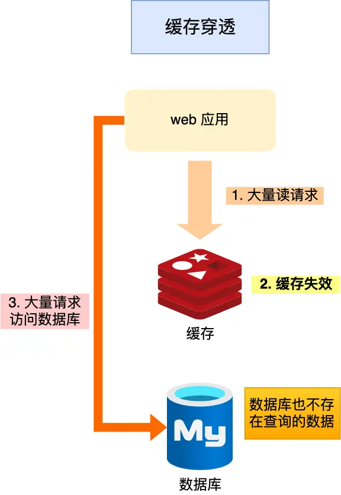

# 缓存雪崩、缓存击穿、缓存穿透

## 缓存雪崩

通常我们为了保证缓存中的数据与数据库中的数据一致性，会给 Redis 里的数据设置过期时间，当缓存数据过期后，用户访问的数据如果不在缓存里，业务系统需要重新生成缓存，因此就会访问数据库，并将数据更新到 Redis 里，这样后续请求都可以直接命中缓存。

那么，当大量缓存数据在同一时间过期（失效）或者 Redis 故障宕机时，如果此时有大量的用户请求，都无法在 Redis 中处理，于是全部请求都直接访问数据库，从而导致数据库的压力骤增，严重的会造成数据库宕机，从而形成一系列连锁反应，造成整个系统崩溃，**这就是缓存雪崩的问题。**
它的表现是：cache miss缓存缺失。

可以看到，发生缓存雪崩有两个原因：

大量数据同时过期；
Redis 故障宕机；
不同的诱因，应对的策略也会不同。

### 大量数据同时过期

常用的应对策略
- 均匀设置过期时间；
- 互斥锁；
- 双 key 策略；
- 后台更新缓存；

1. **均匀设置过期时间**
如果要给缓存数据设置过期时间，应该避免将大量的数据设置成同一个过期时间。我们可以在对缓存数据设置过期时间时，给这些数据的过期时间加上一个随机数，这样就保证数据不会在同一时间过期。

2. **互斥锁** 
当业务线程在处理用户请求时，如果发现访问的数据不在 Redis 里，就加个互斥锁，保证同一时间内只有一个请求来构建缓存（从数据库读取数据，再将数据更新到 Redis 里），当缓存构建完成后，再释放锁。未能获取互斥锁的请求，要么等待锁释放后重新读取缓存，要么就返回空值或者默认值。
实现互斥锁的时候，最好设置超时时间，不然第一个请求拿到了锁，然后这个请求发生了某种意外而一直阻塞，一直不释放锁，这时其他请求也一直拿不到锁，整个系统就会出现无响应的现象。
这里有一点疑惑，互斥锁能解决缓存雪崩的问题吗？？?

3. **双key策略**
我们对缓存数据可以使用两个 key，一个是主 key，会设置过期时间，一个是备 key，不会设置过期，它们只是 key 不一样，但是 value 值是一样的，相当于给缓存数据做了个副本。
当业务线程访问不到「主 key 」的缓存数据时，就直接返回「备 key 」的缓存数据，然后在更新缓存的时候，同时更新「主 key 」和「备 key 」的数据。
双 key 策略的好处是，当主 key 过期了，有大量请求获取缓存数据的时候，直接返回备 key 的数据，这样可以快速响应请求。而不用因为 key 失效而导致大量请求被锁阻塞住（采用了互斥锁，仅一个请求来构建缓存），后续再通知后台线程，重新构建主 key 的数据。
这里也是有点疑惑，这个能解决问题？？？

4. **后台更新缓存**

### Redis宕机

- 服务熔断或请求限流机制；
- 构建 Redis 缓存高可靠集群

1. 服务熔断或者服务限流
   因为 Redis 故障宕机而导致缓存雪崩问题时，我们可以启动服务熔断机制，暂停业务应用对缓存服务的访问，直接返回错误，不用再继续访问数据库，从而降低对数据库的访问压力，保证数据库系统的正常运行，然后等到 Redis 恢复正常后，再允许业务应用访问缓存服务。服务熔断机制是保护数据库的正常允许，但是暂停了业务应用访问缓存服系统，全部业务都无法正常工作为了减少对业务的影响，我们可以启用请求限流机制，只将少部分请求发送到数据库进行处理，再多的请求就在入口直接拒绝服务，等到 Redis 恢复正常并把缓存预热完后，再解除请求限流的机制。
2. 提前构建高可用的redis集群
   服务熔断或请求限流机制是缓存雪崩发生后的应对方案，我们最好通过主从节点的方式构建 Redis 缓存高可靠集群。如果 Redis 缓存的主节点故障宕机，从节点可以切换成为主节点，继续提供缓存服务，避免了由于 Redis 故障宕机而导致的缓存雪崩问题。

## 缓存击穿

我们的业务通常会有几个数据会被频繁地访问，比如秒杀活动，这类被频地访问的数据被称为热点数据。
如果缓存中的某个热点数据过期了，此时大量的请求访问了该热点数据，就无法从缓存中读取，直接访问数据库，数据库很容易就被高并发的请求冲垮，这就是缓存击穿的问题。

可以发现缓存击穿跟缓存雪崩很相似，你可以认为缓存击穿是缓存雪崩的一个子集。

应对缓存击穿可以采取前面说到两种方案：
1. 互斥锁方案，保证同一时间只有一个业务线程更新缓存，未能获取互斥锁的请求，要么等待锁释放后重新读取缓存，要么就返回空值或者默认值。
2. 不给热点数据设置过期时间，由后台异步更新缓存，或者在热点数据准备要过期前，提前通知后台线程更新缓存以及重新设置过期时间；

缓存雪崩时大量的redis key同一时间失效。
缓存击穿时热点redis key失效。

## 缓存穿透

外部用户访问的数据既不在redis中，也不在数据库中。导致请求在访问缓存时，发现缓存缺失，再去访问数据库时，发现数据库中也没有要访问的数据，没办法构建缓存数据，来服务后续的请求。那么当有大量这样的请求到来时，数据库的压力骤增，这就是缓存穿透的问题。

缓存穿透的发生一般有这两种情况：
- 业务误操作，缓存中的数据和数据库中的数据都被误删除了，所以导致缓存和数据库中都没有数据；
- 黑客恶意攻击，故意大量访问某些读取不存在数据的业务；

第一种方案，非法请求的限制  
当有大量恶意请求访问不存在的数据的时候，也会发生缓存穿透，因此在 API 入口处我们要判断求请求参数是否合理，请求参数是否含有非法值、请求字段是否存在，如果判断出是恶意请求就直接返回错误，避免进一步访问缓存和数据库。

第二种方案，缓存空值或者默认值  
当我们线上业务发现缓存穿透的现象时，可以针对查询的数据，在缓存中设置一个空值或者默认值，这样后续请求就可以从缓存中读取到空值或者默认值，返回给应用，而不会继续查询数据库。

第三种方案，使用布隆过滤器  
如果布隆过滤器告诉你不存在，那么一定是不存在。
如果布隆过滤器告诉你存在，那么可能存在。

## 互斥锁方案

在缓存穿透和缓存击穿这部分使用互斥锁方案，它能起到什么作用？
它主要起到的作用就是，在cache miss的时候，避免大量线程并发地访问数据库。从而给数据库造成过大的压力。

可能会有疑问，redis查不到，不是可以去查数据库，然后将数据库中的内容更新到缓存中吗？
设想这样的一个场景，10万个线程需要读某个key，但是cache miss。这个时候，第一个线程访问数据库，然后将数据库中的数组更新到缓存中。但是，在它更新缓存完成之前，其他线程也可能会这样做（查数据库，更新缓存）。这会给数据库带来高并发的压力。

如何实现互斥锁

- 单机系统，语言层面的互斥锁就可以实现。
- 分布系统，可以借助redis实现。

